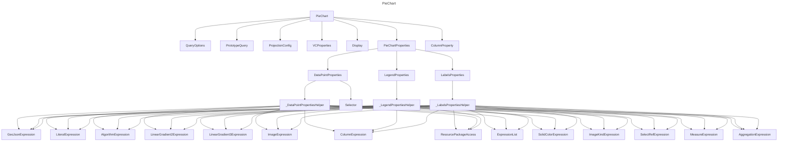

```mermaid
---
title: PieChart
---
graph 
2721641876416["ColumnExpression"]
2722178319552["_DataPointPropertiesHelper"]
2721641835424["LiteralExpression"]
2721641858848["LinearGradient2Expression"]
2721641839328["AggregationExpression"]
2721641889104["GeoJsonExpression"]
2722076049904["QueryOptions"]
2721641891056["AlgorithmExpression"]
2721641892032["ExpressionList"]
2722076168976["Selector"]
2721641883248["SelectRefExpression"]
2722216682256["LabelsProperties"]
2722076123104["PrototypeQuery"]
2721641874464["SolidColorExpression"]
2721641884224["ResourcePackageAccess"]
2722216686160["LegendProperties"]
2722076034288["ProjectionConfig"]
2721641852016["MeasureExpression"]
2722076033312["VCProperties"]
2721641878368["ImageKindExpression"]
2722076045024["Display"]
2722216703728["PieChartProperties"]
2722113511200["ColumnProperty"]
2722216676400["_LegendPropertiesHelper"]
2722216710560["PieChart"]
2722216690064["_LabelsPropertiesHelper"]
2721641859824["LinearGradient3Expression"]
2722216689088["DataPointProperties"]
2721641886176["ImageExpression"]
2722216676400 ---> 2721641874464
2722216689088 ---> 2722076168976
2722216690064 ---> 2721641835424
2722216710560 ---> 2722216703728
2722216710560 ---> 2722113511200
2722178319552 ---> 2721641889104
2722216676400 ---> 2721641839328
2722216690064 ---> 2721641859824
2722216676400 ---> 2721641883248
2722178319552 ---> 2721641835424
2722216710560 ---> 2722076123104
2722216676400 ---> 2721641852016
2722216682256 ---> 2722216690064
2722216690064 ---> 2721641852016
2722216676400 ---> 2721641835424
2722178319552 ---> 2721641891056
2722216710560 ---> 2722076045024
2722178319552 ---> 2721641858848
2722216690064 ---> 2721641858848
2722216703728 ---> 2722216689088
2722216676400 ---> 2721641859824
2722178319552 ---> 2721641859824
2722216703728 ---> 2722216682256
2722216690064 ---> 2721641839328
2722178319552 ---> 2721641886176
2722216690064 ---> 2721641884224
2722216690064 ---> 2721641892032
2722216710560 ---> 2722076034288
2722178319552 ---> 2721641876416
2722216690064 ---> 2721641889104
2722216676400 ---> 2721641876416
2722216676400 ---> 2721641891056
2722216690064 ---> 2721641883248
2722216676400 ---> 2721641889104
2722216676400 ---> 2721641878368
2722178319552 ---> 2721641884224
2722216689088 ---> 2722178319552
2722178319552 ---> 2721641892032
2722216676400 ---> 2721641886176
2722178319552 ---> 2721641874464
2722216690064 ---> 2721641876416
2722216686160 ---> 2722216676400
2722216676400 ---> 2721641884224
2722216690064 ---> 2721641886176
2722216690064 ---> 2721641878368
2722178319552 ---> 2721641878368
2722178319552 ---> 2721641883248
2722216710560 ---> 2722076049904
2722216690064 ---> 2721641891056
2722216690064 ---> 2721641874464
2722178319552 ---> 2721641852016
2722178319552 ---> 2721641839328
2722216703728 ---> 2722216686160
2722216710560 ---> 2722076033312
2722216676400 ---> 2721641858848
2722216676400 ---> 2721641892032
```