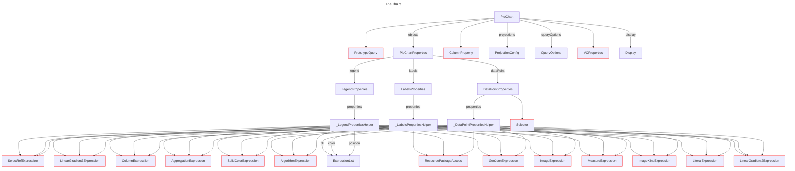

```mermaid
---
title: PieChart
---
graph 
2430626040416["_LegendPropertiesHelper"]
2430071951472["PrototypeQuery"]
style 2430071951472 stroke:#ff0000,stroke-width:1px
2430071907552["SolidColorExpression"]
style 2430071907552 stroke:#ff0000,stroke-width:1px
2430626069696["PieChartProperties"]
2430071930000["AlgorithmExpression"]
style 2430071930000 stroke:#ff0000,stroke-width:1px
2430626042368["_LabelsPropertiesHelper"]
2430071921216["ResourcePackageAccess"]
style 2430071921216 stroke:#ff0000,stroke-width:1px
2430071926096["ImageKindExpression"]
style 2430071926096 stroke:#ff0000,stroke-width:1px
2430552678256["ColumnProperty"]
style 2430552678256 stroke:#ff0000,stroke-width:1px
2430514799136["ProjectionConfig"]
2430071925120["ColumnExpression"]
style 2430071925120 stroke:#ff0000,stroke-width:1px
2430071920240["LinearGradient2Expression"]
style 2430071920240 stroke:#ff0000,stroke-width:1px
2430071930976["ExpressionList"]
2430071910480["LinearGradient3Expression"]
style 2430071910480 stroke:#ff0000,stroke-width:1px
2430514817680["QueryOptions"]
2430071888032["MeasureExpression"]
style 2430071888032 stroke:#ff0000,stroke-width:1px
2430626052128["DataPointProperties"]
2430071923168["SelectRefExpression"]
style 2430071923168 stroke:#ff0000,stroke-width:1px
2430071919264["ImageExpression"]
style 2430071919264 stroke:#ff0000,stroke-width:1px
2430626045296["LabelsProperties"]
2430626049200["_DataPointPropertiesHelper"]
2430071745536["Selector"]
style 2430071745536 stroke:#ff0000,stroke-width:1px
2430071889008["AggregationExpression"]
style 2430071889008 stroke:#ff0000,stroke-width:1px
2430071918288["GeoJsonExpression"]
style 2430071918288 stroke:#ff0000,stroke-width:1px
2430514805968["VCProperties"]
style 2430514805968 stroke:#ff0000,stroke-width:1px
2430626070672["PieChart"]
2430626043344["LegendProperties"]
2430514810848["Display"]
2430071887056["LiteralExpression"]
style 2430071887056 stroke:#ff0000,stroke-width:1px
2430626069696 --->|labels| 2430626045296
2430626040416 ---> 2430071910480
2430626070672 ---> 2430071951472
2430626049200 ---> 2430071921216
2430626049200 ---> 2430071925120
2430626052128 ---> 2430071745536
2430626049200 ---> 2430071923168
2430626040416 ---> 2430071907552
2430626040416 ---> 2430071930000
2430626049200 ---> 2430071907552
2430626049200 ---> 2430071919264
2430626042368 ---> 2430071923168
2430626040416 --->|position| 2430071930976
2430626049200 ---> 2430071910480
2430626042368 ---> 2430071925120
2430626042368 ---> 2430071889008
2430626042368 ---> 2430071888032
2430626042368 ---> 2430071930000
2430626049200 ---> 2430071918288
2430626040416 ---> 2430071923168
2430626042368 --->|color| 2430071930976
2430626040416 ---> 2430071889008
2430626042368 ---> 2430071910480
2430626049200 ---> 2430071889008
2430626049200 ---> 2430071926096
2430626042368 ---> 2430071919264
2430626052128 --->|properties| 2430626049200
2430626049200 --->|fill| 2430071930976
2430626070672 ---> 2430552678256
2430626042368 ---> 2430071918288
2430626040416 ---> 2430071918288
2430626069696 --->|legend| 2430626043344
2430626040416 ---> 2430071921216
2430626049200 ---> 2430071930000
2430626070672 --->|display| 2430514810848
2430626069696 --->|dataPoint| 2430626052128
2430626040416 ---> 2430071926096
2430626042368 ---> 2430071887056
2430626049200 ---> 2430071887056
2430626040416 ---> 2430071887056
2430626070672 --->|objects| 2430626069696
2430626049200 ---> 2430071920240
2430626049200 ---> 2430071888032
2430626043344 --->|properties| 2430626040416
2430626042368 ---> 2430071920240
2430626070672 --->|projections| 2430514799136
2430626045296 --->|properties| 2430626042368
2430626040416 ---> 2430071925120
2430626042368 ---> 2430071907552
2430626040416 ---> 2430071888032
2430626042368 ---> 2430071921216
2430626040416 ---> 2430071919264
2430626042368 ---> 2430071926096
2430626070672 ---> 2430514805968
2430626070672 --->|queryOptions| 2430514817680
2430626040416 ---> 2430071920240
```