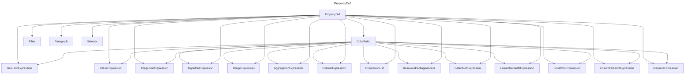

```mermaid
---
title: PropertyDef
---
graph 
2722076046000["ColorRule1"]
2721641876416["ColumnExpression"]
2721641884224["ResourcePackageAccess"]
2721641835424["LiteralExpression"]
2722076109440["Filter"]
2722076032336["PropertyDef"]
2721641858848["LinearGradient2Expression"]
2721641852016["MeasureExpression"]
2721641839328["AggregationExpression"]
2721641878368["ImageKindExpression"]
2721641889104["GeoJsonExpression"]
2721641891056["AlgorithmExpression"]
2722076189472["Paragraph"]
2721641892032["ExpressionList"]
2722076168976["Selector"]
2721641859824["LinearGradient3Expression"]
2721641886176["ImageExpression"]
2721641883248["SelectRefExpression"]
2721641874464["SolidColorExpression"]
2722076032336 ---> 2722076189472
2722076046000 ---> 2721641886176
2722076046000 ---> 2721641839328
2722076032336 ---> 2721641889104
2722076032336 ---> 2721641835424
2722076046000 ---> 2721641876416
2722076046000 ---> 2721641892032
2722076046000 ---> 2721641891056
2722076032336 ---> 2721641878368
2722076046000 ---> 2721641878368
2722076032336 ---> 2721641891056
2722076032336 ---> 2722076046000
2722076032336 ---> 2721641859824
2722076046000 ---> 2721641884224
2722076046000 ---> 2721641883248
2722076032336 ---> 2721641874464
2722076046000 ---> 2721641858848
2722076046000 ---> 2721641874464
2722076046000 ---> 2721641859824
2722076032336 ---> 2721641858848
2722076032336 ---> 2721641852016
2722076032336 ---> 2721641886176
2722076032336 ---> 2721641883248
2722076032336 ---> 2721641884224
2722076032336 ---> 2721641839328
2722076032336 ---> 2722076168976
2722076046000 ---> 2721641835424
2722076046000 ---> 2721641889104
2722076032336 ---> 2721641876416
2722076032336 ---> 2721641892032
2722076046000 ---> 2721641852016
2722076032336 ---> 2722076109440
```