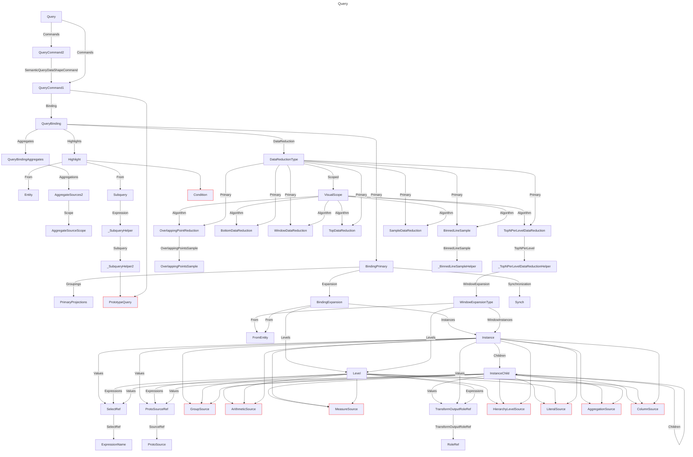

```mermaid
---
title: Query
---
graph 
2430071814832["TransformOutputRoleRef"]
2430664197904["Level"]
2430664199856["PrimaryProjections"]
2430664233040["QueryBinding"]
2430664230112["AggregateSourceScope"]
2430071366800["ExpressionName"]
2430664219376["_TopNPerLevelDataReductionHelper"]
2430071353136["Entity"]
2430664240848["Query"]
2430664206688["BindingPrimary"]
2430664202784["InstanceChild"]
2430664215472["VisualScope"]
2430664210592["OverlappingPointsSample"]
2430664239872["QueryCommand2"]
2430071969040["Subquery"]
2430664225232["DataReductionType"]
2430071955376["_SubqueryHelper2"]
2430071825568["ProtoSourceRef"]
2430664211568["BinnedLineSample"]
2430071808976["GroupSource"]
style 2430071808976 stroke:#ff0000,stroke-width:1px
2430664226208["OverlappingPointReduction"]
2430664231088["AggregateSources2"]
2430071968064["_SubqueryHelper"]
2430071882176["Condition"]
style 2430071882176 stroke:#ff0000,stroke-width:1px
2430664244752["Highlight"]
2430071382416["ArithmeticSource"]
style 2430071382416 stroke:#ff0000,stroke-width:1px
2430071820688["RoleRef"]
2430664198880["BottomDataReduction"]
2430071951472["PrototypeQuery"]
style 2430071951472 stroke:#ff0000,stroke-width:1px
2430664216448["QueryBindingAggregates"]
2430664192048["FromEntity"]
2430071359968["MeasureSource"]
style 2430071359968 stroke:#ff0000,stroke-width:1px
2430071356064["SelectRef"]
2430664193024["BindingExpansion"]
2430071363872["HierarchyLevelSource"]
style 2430071363872 stroke:#ff0000,stroke-width:1px
2430071816784["LiteralSource"]
style 2430071816784 stroke:#ff0000,stroke-width:1px
2430664208640["WindowDataReduction"]
2430071358016["AggregationSource"]
style 2430071358016 stroke:#ff0000,stroke-width:1px
2430664194976["TopDataReduction"]
2430664221328["TopNPerLevelDataReduction"]
2430071365824["ColumnSource"]
style 2430071365824 stroke:#ff0000,stroke-width:1px
2430071819712["ProtoSource"]
2430664227184["WindowExpansionType"]
2430664190096["Synch"]
2430664207664["SampleDataReduction"]
2430664222304["_BinnedLineSampleHelper"]
2430664195952["Instance"]
2430664237920["QueryCommand1"]
2430664225232 --->|Primary| 2430664211568
2430664215472 --->|Algorithm| 2430664198880
2430664202784 ---> 2430071382416
2430664202784 ---> 2430071359968
2430664215472 --->|Algorithm| 2430664221328
2430664195952 --->|Values| 2430071356064
2430664237920 --->|Binding| 2430664233040
2430664202784 ---> 2430071365824
2430664225232 --->|Primary| 2430664221328
2430664193024 --->|Instances| 2430664195952
2430664197904 --->|Expressions| 2430071356064
2430664202784 ---> 2430071816784
2430664195952 --->|Values| 2430071825568
2430664195952 ---> 2430071808976
2430664195952 --->|Children| 2430664202784
2430664225232 --->|Scoped| 2430664215472
2430664197904 ---> 2430071363872
2430664193024 --->|Levels| 2430664197904
2430664215472 --->|Algorithm| 2430664211568
2430664197904 ---> 2430071816784
2430664239872 --->|SemanticQueryDataShapeCommand| 2430664237920
2430664195952 ---> 2430071358016
2430664225232 --->|Primary| 2430664208640
2430664197904 ---> 2430071808976
2430664215472 --->|Algorithm| 2430664194976
2430664202784 --->|Values| 2430071814832
2430664233040 --->|Aggregates| 2430664216448
2430664215472 --->|Algorithm| 2430664226208
2430664202784 ---> 2430071358016
2430664195952 --->|Values| 2430071814832
2430664202784 ---> 2430071363872
2430071969040 --->|Expression| 2430071968064
2430664225232 --->|Primary| 2430664198880
2430664197904 ---> 2430071365824
2430664244752 ---> 2430071882176
2430664211568 --->|BinnedLineSample| 2430664222304
2430664225232 --->|Primary| 2430664194976
2430664197904 ---> 2430071382416
2430664195952 ---> 2430071365824
2430664225232 --->|Primary| 2430664226208
2430664206688 --->|Expansion| 2430664193024
2430664226208 --->|OverlappingPointsSample| 2430664210592
2430664202784 --->|Values| 2430071356064
2430071955376 ---> 2430071951472
2430664195952 ---> 2430071816784
2430664240848 --->|Commands| 2430664237920
2430664197904 ---> 2430071358016
2430664227184 --->|From| 2430664192048
2430071825568 --->|SourceRef| 2430071819712
2430664202784 ---> 2430071808976
2430664244752 --->|From| 2430071353136
2430664225232 --->|Primary| 2430664207664
2430664215472 --->|Algorithm| 2430664208640
2430071356064 --->|SelectRef| 2430071366800
2430664195952 ---> 2430071359968
2430664221328 --->|TopNPerLevel| 2430664219376
2430664215472 --->|Algorithm| 2430664207664
2430664227184 --->|WindowInstances| 2430664195952
2430664197904 --->|Expressions| 2430071825568
2430664202784 --->|Values| 2430071825568
2430664206688 --->|Synchronization| 2430664190096
2430664197904 ---> 2430071359968
2430664206688 --->|Groupings| 2430664199856
2430664202784 --->|Children| 2430664202784
2430664195952 ---> 2430071382416
2430664233040 --->|Highlights| 2430664244752
2430664195952 ---> 2430071363872
2430071814832 --->|TransformOutputRoleRef| 2430071820688
2430664244752 --->|From| 2430071969040
2430664233040 --->|Primary| 2430664206688
2430664227184 --->|Levels| 2430664197904
2430664231088 --->|Scope| 2430664230112
2430664233040 --->|DataReduction| 2430664225232
2430664237920 ---> 2430071951472
2430664193024 --->|From| 2430664192048
2430664240848 --->|Commands| 2430664239872
2430071968064 --->|Subquery| 2430071955376
2430664197904 --->|Expressions| 2430071814832
2430664216448 --->|Aggregations| 2430664231088
2430664219376 --->|WindowExpansion| 2430664227184
```