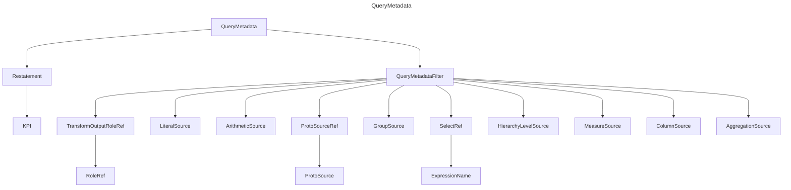

```mermaid
---
title: QueryMetadata
---
graph 
2721642009152["MeasureSource"]
2721642023792["ProtoSourceRef"]
2722254638608["QueryMetadataFilter"]
2721642039408["ProtoSource"]
2721642022816["LiteralSource"]
2722254636656["KPI"]
2721642040384["RoleRef"]
2721642012080["HierarchyLevelSource"]
2721642014032["ColumnSource"]
2722254621040["Restatement"]
2721642013056["ExpressionName"]
2721642003296["AggregationSource"]
2722254646416["QueryMetadata"]
2721642031600["ArithmeticSource"]
2721642016960["SelectRef"]
2721642024768["TransformOutputRoleRef"]
2721642035504["GroupSource"]
2722254646416 ---> 2722254621040
2722254638608 ---> 2721642024768
2722254646416 ---> 2722254638608
2722254638608 ---> 2721642022816
2722254638608 ---> 2721642031600
2721642024768 ---> 2721642040384
2722254638608 ---> 2721642023792
2721642023792 ---> 2721642039408
2722254638608 ---> 2721642035504
2722254621040 ---> 2722254636656
2722254638608 ---> 2721642016960
2722254638608 ---> 2721642012080
2721642016960 ---> 2721642013056
2722254638608 ---> 2721642009152
2722254638608 ---> 2721642014032
2722254638608 ---> 2721642003296
```