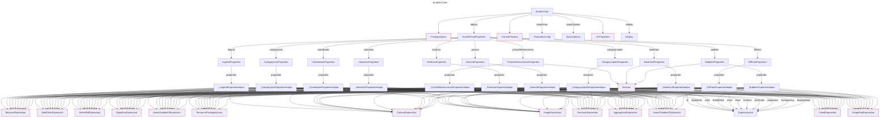

```mermaid
---
title: ScatterChart
---
graph 
2430626135088["_PlotAreaPropertiesHelper"]
2430626138016["LegendProperties"]
2430626098976["DataPointProperties"]
2430626131184["PlotAreaProperties"]
2430071951472["PrototypeQuery"]
style 2430071951472 stroke:#ff0000,stroke-width:1px
2430626157536["Y1AxisReferenceLineProperties"]
2430071907552["SolidColorExpression"]
style 2430071907552 stroke:#ff0000,stroke-width:1px
2430626116544["FillPointProperties"]
2430071930000["AlgorithmExpression"]
style 2430071930000 stroke:#ff0000,stroke-width:1px
2430626159488["ScatterChartProperties"]
2430626095072["CategoryAxisProperties"]
2430626105808["GeneralProperties"]
2430626119472["_GeneralPropertiesHelper"]
2430071921216["ResourcePackageAccess"]
style 2430071921216 stroke:#ff0000,stroke-width:1px
2430071926096["ImageKindExpression"]
style 2430071926096 stroke:#ff0000,stroke-width:1px
2430626167296["ScatterChart"]
2430626145824["_ValueAxisPropertiesHelper"]
2430552678256["ColumnProperty"]
style 2430552678256 stroke:#ff0000,stroke-width:1px
2430514799136["ProjectionConfig"]
2430626079456["_CategoryAxisPropertiesHelper"]
2430071925120["ColumnExpression"]
style 2430071925120 stroke:#ff0000,stroke-width:1px
2430626075552["_BubblesPropertiesHelper"]
2430071920240["LinearGradient2Expression"]
style 2430071920240 stroke:#ff0000,stroke-width:1px
2430071930976["ExpressionList"]
2430626128256["_LegendPropertiesHelper"]
2430071910480["LinearGradient3Expression"]
style 2430071910480 stroke:#ff0000,stroke-width:1px
2430514817680["QueryOptions"]
2430626155584["_Y1AxisReferenceLinePropertiesHelper"]
2430071888032["MeasureExpression"]
style 2430071888032 stroke:#ff0000,stroke-width:1px
2430071923168["SelectRefExpression"]
style 2430071923168 stroke:#ff0000,stroke-width:1px
2430626108736["_DataPointPropertiesHelper"]
2430071919264["ImageExpression"]
style 2430071919264 stroke:#ff0000,stroke-width:1px
2430071745536["Selector"]
style 2430071745536 stroke:#ff0000,stroke-width:1px
2430626060912["BubblesProperties"]
2430626150704["ValueAxisProperties"]
2430071889008["AggregationExpression"]
style 2430071889008 stroke:#ff0000,stroke-width:1px
2430626088240["CategoryLabelsProperties"]
2430071918288["GeoJsonExpression"]
style 2430071918288 stroke:#ff0000,stroke-width:1px
2430626114592["_FillPointPropertiesHelper"]
2430514805968["VCProperties"]
style 2430514805968 stroke:#ff0000,stroke-width:1px
2430626110688["ColorBorderProperties"]
2430626086288["_ColorBorderPropertiesHelper"]
2430514810848["Display"]
2430071887056["LiteralExpression"]
style 2430071887056 stroke:#ff0000,stroke-width:1px
2430626080432["_CategoryLabelsPropertiesHelper"]
2430626075552 ---> 2430071923168
2430626080432 ---> 2430071910480
2430626135088 ---> 2430071918288
2430626145824 ---> 2430071930000
2430626086288 ---> 2430071919264
2430626108736 ---> 2430071888032
2430626080432 ---> 2430071921216
2430626155584 ---> 2430071888032
2430626108736 ---> 2430071918288
2430626155584 ---> 2430071921216
2430626128256 ---> 2430071888032
2430626114592 ---> 2430071907552
2430626145824 ---> 2430071889008
2430626075552 ---> 2430071919264
2430626155584 ---> 2430071930000
2430626159488 --->|dataPoint| 2430626098976
2430626155584 --->|displayName| 2430071930976
2430626119472 ---> 2430071921216
2430626116544 --->|properties| 2430626114592
2430626075552 ---> 2430071925120
2430626080432 ---> 2430071907552
2430626119472 ---> 2430071888032
2430626114592 ---> 2430071925120
2430626114592 ---> 2430071910480
2430626075552 ---> 2430071910480
2430626075552 ---> 2430071918288
2430626114592 ---> 2430071919264
2430626167296 --->|queryOptions| 2430514817680
2430626145824 ---> 2430071907552
2430626119472 ---> 2430071887056
2430626135088 ---> 2430071889008
2430626075552 ---> 2430071907552
2430626135088 ---> 2430071910480
2430626108736 ---> 2430071907552
2430626086288 ---> 2430071923168
2430626167296 --->|objects| 2430626159488
2430626155584 ---> 2430071907552
2430626135088 --->|transparency| 2430071930976
2430626128256 ---> 2430071889008
2430626131184 --->|properties| 2430626135088
2430626114592 ---> 2430071888032
2430626157536 --->|properties| 2430626155584
2430626079456 ---> 2430071907552
2430626086288 ---> 2430071889008
2430626114592 ---> 2430071923168
2430626108736 ---> 2430071923168
2430626079456 ---> 2430071888032
2430626135088 ---> 2430071925120
2430626108736 ---> 2430071887056
2430626119472 ---> 2430071930000
2430626159488 --->|valueAxis| 2430626150704
2430626079456 ---> 2430071918288
2430626075552 ---> 2430071930000
2430626119472 --->|responsive| 2430071930976
2430626138016 --->|properties| 2430626128256
2430626159488 --->|legend| 2430626138016
2430626145824 ---> 2430071923168
2430626167296 ---> 2430514805968
2430626079456 ---> 2430071925120
2430626079456 ---> 2430071921216
2430626135088 ---> 2430071923168
2430626114592 ---> 2430071926096
2430626108736 ---> 2430071930000
2430626128256 ---> 2430071921216
2430626128256 ---> 2430071910480
2430626108736 ---> 2430071926096
2430626108736 ---> 2430071919264
2430626114592 ---> 2430071920240
2430626060912 ---> 2430071745536
2430626075552 ---> 2430071920240
2430626079456 ---> 2430071919264
2430626159488 --->|y1AxisReferenceLine| 2430626157536
2430626119472 ---> 2430071919264
2430626145824 ---> 2430071926096
2430626108736 ---> 2430071910480
2430626079456 --->|axisScale| 2430071930976
2430626080432 ---> 2430071923168
2430626088240 --->|properties| 2430626080432
2430626080432 ---> 2430071918288
2430626119472 ---> 2430071925120
2430626075552 ---> 2430071888032
2430626145824 ---> 2430071910480
2430626098976 ---> 2430071745536
2430626155584 ---> 2430071920240
2430626145824 ---> 2430071920240
2430626155584 ---> 2430071925120
2430626086288 ---> 2430071907552
2430626080432 ---> 2430071888032
2430626119472 ---> 2430071910480
2430626080432 ---> 2430071920240
2430626080432 ---> 2430071919264
2430626135088 ---> 2430071887056
2430626119472 ---> 2430071918288
2430626159488 --->|bubbles| 2430626060912
2430626128256 --->|fontSize| 2430071930976
2430626086288 ---> 2430071930000
2430626079456 ---> 2430071920240
2430626080432 ---> 2430071930000
2430626128256 ---> 2430071930000
2430626080432 ---> 2430071926096
2430626108736 ---> 2430071921216
2430626095072 --->|properties| 2430626079456
2430626105808 --->|properties| 2430626119472
2430626086288 ---> 2430071920240
2430626080432 ---> 2430071887056
2430626135088 ---> 2430071921216
2430626075552 ---> 2430071926096
2430626159488 --->|general| 2430626105808
2430626075552 ---> 2430071921216
2430626108736 ---> 2430071925120
2430626098976 --->|properties| 2430626108736
2430626086288 ---> 2430071887056
2430626080432 ---> 2430071925120
2430626086288 ---> 2430071926096
2430626128256 ---> 2430071887056
2430626128256 ---> 2430071926096
2430626167296 ---> 2430552678256
2430626159488 --->|plotArea| 2430626131184
2430626128256 ---> 2430071923168
2430626150704 --->|properties| 2430626145824
2430626114592 ---> 2430071930000
2430626119472 ---> 2430071907552
2430626086288 --->|show| 2430071930976
2430626075552 ---> 2430071889008
2430626128256 ---> 2430071907552
2430626128256 ---> 2430071918288
2430626135088 ---> 2430071920240
2430626114592 --->|show| 2430071930976
2430626167296 --->|display| 2430514810848
2430626145824 ---> 2430071921216
2430626079456 ---> 2430071889008
2430626119472 ---> 2430071889008
2430626157536 ---> 2430071745536
2430626135088 ---> 2430071930000
2430626145824 ---> 2430071925120
2430626114592 ---> 2430071918288
2430626155584 ---> 2430071887056
2430626119472 ---> 2430071923168
2430626075552 --->|bubbleSize| 2430071930976
2430626119472 ---> 2430071926096
2430626108736 ---> 2430071920240
2430626119472 ---> 2430071920240
2430626155584 ---> 2430071923168
2430626079456 ---> 2430071910480
2430626075552 ---> 2430071887056
2430626135088 ---> 2430071888032
2430626086288 ---> 2430071925120
2430626080432 ---> 2430071889008
2430626086288 ---> 2430071888032
2430626079456 ---> 2430071930000
2430626167296 ---> 2430071951472
2430626080432 --->|color| 2430071930976
2430626114592 ---> 2430071887056
2430626079456 ---> 2430071926096
2430626145824 ---> 2430071888032
2430626114592 ---> 2430071889008
2430626135088 ---> 2430071919264
2430626167296 --->|projections| 2430514799136
2430626155584 ---> 2430071889008
2430626128256 ---> 2430071920240
2430626145824 ---> 2430071887056
2430626079456 ---> 2430071923168
2430626145824 ---> 2430071919264
2430626155584 ---> 2430071926096
2430626114592 ---> 2430071921216
2430626159488 --->|categoryLabels| 2430626088240
2430626159488 --->|categoryAxis| 2430626095072
2430626128256 ---> 2430071919264
2430626086288 ---> 2430071918288
2430626145824 --->|alignZeros| 2430071930976
2430626155584 ---> 2430071910480
2430626108736 --->|fill| 2430071930976
2430626086288 ---> 2430071921216
2430626145824 ---> 2430071918288
2430626155584 ---> 2430071918288
2430626060912 --->|properties| 2430626075552
2430626159488 --->|colorBorder| 2430626110688
2430626155584 ---> 2430071919264
2430626135088 ---> 2430071926096
2430626110688 --->|properties| 2430626086288
2430626079456 ---> 2430071887056
2430626108736 ---> 2430071889008
2430626128256 ---> 2430071925120
2430626159488 --->|fillPoint| 2430626116544
2430626135088 ---> 2430071907552
2430626086288 ---> 2430071910480
```