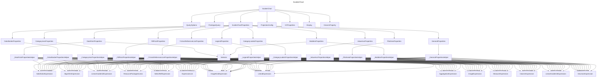

```mermaid
---
title: ScatterChart
---
graph 
2722216757408["_LegendPropertiesHelper"]
2722216751552["_PlotAreaPropertiesHelper"]
2721641876416["ColumnExpression"]
2722216717392["CategoryAxisProperties"]
2722216701776["BubblesProperties"]
2721641835424["LiteralExpression"]
2722216759360["GeneralProperties"]
2722216748624["_GeneralPropertiesHelper"]
2721641858848["LinearGradient2Expression"]
2721641839328["AggregationExpression"]
2721641889104["GeoJsonExpression"]
2722076049904["QueryOptions"]
2721641891056["AlgorithmExpression"]
2722216791568["ScatterChart"]
2722216780832["_ValueAxisPropertiesHelper"]
2721641892032["ExpressionList"]
2722216733008["_DataPointPropertiesHelper"]
2722076168976["Selector"]
2722216781808["PlotAreaProperties"]
2722216774976["_Y1AxisReferenceLinePropertiesHelper"]
2722216695920["_CategoryAxisPropertiesHelper"]
2722216724224["_ColorBorderPropertiesHelper"]
2722216783760["ValueAxisProperties"]
2722216750576["FillPointProperties"]
2721641883248["SelectRefExpression"]
2722076123104["PrototypeQuery"]
2721641874464["SolidColorExpression"]
2722216796448["ScatterChartProperties"]
2721641884224["ResourcePackageAccess"]
2722076034288["ProjectionConfig"]
2722216729104["_CategoryLabelsPropertiesHelper"]
2721641852016["MeasureExpression"]
2722076033312["VCProperties"]
2721641878368["ImageKindExpression"]
2722076045024["Display"]
2722216721296["CategoryLabelsProperties"]
2722113511200["ColumnProperty"]
2722216731056["ColorBorderProperties"]
2722216740816["DataPointProperties"]
2721641859824["LinearGradient3Expression"]
2722216699824["_BubblesPropertiesHelper"]
2722216786688["Y1AxisReferenceLineProperties"]
2722216762288["LegendProperties"]
2721641886176["ImageExpression"]
2722216737888["_FillPointPropertiesHelper"]
2722216748624 ---> 2721641858848
2722216737888 ---> 2721641878368
2722216695920 ---> 2721641886176
2722216724224 ---> 2721641886176
2722216701776 ---> 2722076168976
2722216724224 ---> 2721641883248
2722216733008 ---> 2721641892032
2722216751552 ---> 2721641852016
2722216780832 ---> 2721641852016
2722216729104 ---> 2721641878368
2722216695920 ---> 2721641883248
2722216796448 ---> 2722216701776
2722216751552 ---> 2721641874464
2722216780832 ---> 2721641884224
2722216757408 ---> 2721641859824
2722216717392 ---> 2722216695920
2722216780832 ---> 2721641858848
2722216699824 ---> 2721641892032
2722216748624 ---> 2721641874464
2722216757408 ---> 2721641858848
2722216737888 ---> 2721641874464
2722216729104 ---> 2721641858848
2722216796448 ---> 2722216781808
2722216757408 ---> 2721641891056
2722216748624 ---> 2721641876416
2722216748624 ---> 2721641883248
2722216699824 ---> 2721641874464
2722216757408 ---> 2721641884224
2722216751552 ---> 2721641891056
2722216733008 ---> 2721641883248
2722216757408 ---> 2721641892032
2722216699824 ---> 2721641835424
2722216791568 ---> 2722076049904
2722216699824 ---> 2721641891056
2722216695920 ---> 2721641835424
2722216748624 ---> 2721641839328
2722216774976 ---> 2721641886176
2722216774976 ---> 2721641892032
2722216774976 ---> 2721641859824
2722216733008 ---> 2721641876416
2722216748624 ---> 2721641859824
2722216762288 ---> 2722216757408
2722216737888 ---> 2721641891056
2722216780832 ---> 2721641889104
2722216751552 ---> 2721641835424
2722216791568 ---> 2722076034288
2722216729104 ---> 2721641892032
2722216751552 ---> 2721641889104
2722216781808 ---> 2722216751552
2722216695920 ---> 2721641839328
2722216699824 ---> 2721641858848
2722216774976 ---> 2721641874464
2722216729104 ---> 2721641891056
2722216757408 ---> 2721641876416
2722216748624 ---> 2721641892032
2722216751552 ---> 2721641859824
2722216729104 ---> 2721641874464
2722216780832 ---> 2721641876416
2722216695920 ---> 2721641874464
2722216733008 ---> 2721641891056
2722216791568 ---> 2722076123104
2722216780832 ---> 2721641859824
2722216796448 ---> 2722216783760
2722216699824 ---> 2721641878368
2722216737888 ---> 2721641883248
2722216699824 ---> 2721641889104
2722216748624 ---> 2721641886176
2722216780832 ---> 2721641891056
2722216751552 ---> 2721641839328
2722216733008 ---> 2721641886176
2722216740816 ---> 2722216733008
2722216737888 ---> 2721641835424
2722216699824 ---> 2721641884224
2722216791568 ---> 2722076033312
2722216729104 ---> 2721641839328
2722216774976 ---> 2721641883248
2722216737888 ---> 2721641876416
2722216748624 ---> 2721641835424
2722216729104 ---> 2721641884224
2722216796448 ---> 2722216759360
2722216780832 ---> 2721641874464
2722216774976 ---> 2721641884224
2722216721296 ---> 2722216729104
2722216796448 ---> 2722216717392
2722216780832 ---> 2721641835424
2722216791568 ---> 2722113511200
2722216729104 ---> 2721641889104
2722216731056 ---> 2722216724224
2722216774976 ---> 2721641878368
2722216737888 ---> 2721641852016
2722216751552 ---> 2721641884224
2722216733008 ---> 2721641839328
2722216796448 ---> 2722216731056
2722216724224 ---> 2721641891056
2722216750576 ---> 2722216737888
2722216724224 ---> 2721641878368
2722216733008 ---> 2721641874464
2722216757408 ---> 2721641835424
2722216757408 ---> 2721641889104
2722216695920 ---> 2721641884224
2722216729104 ---> 2721641852016
2722216724224 ---> 2721641874464
2722216737888 ---> 2721641892032
2722216699824 ---> 2721641839328
2722216786688 ---> 2722076168976
2722216783760 ---> 2722216780832
2722216740816 ---> 2722076168976
2722216695920 ---> 2721641852016
2722216796448 ---> 2722216721296
2722216780832 ---> 2721641878368
2722216699824 ---> 2721641883248
2722216748624 ---> 2721641878368
2722216737888 ---> 2721641884224
2722216759360 ---> 2722216748624
2722216751552 ---> 2721641858848
2722216748624 ---> 2721641884224
2722216724224 ---> 2721641889104
2722216780832 ---> 2721641883248
2722216780832 ---> 2721641892032
2722216774976 ---> 2721641839328
2722216774976 ---> 2721641852016
2722216724224 ---> 2721641884224
2722216733008 ---> 2721641884224
2722216774976 ---> 2721641858848
2722216737888 ---> 2721641839328
2722216695920 ---> 2721641858848
2722216724224 ---> 2721641852016
2722216699824 ---> 2721641852016
2722216748624 ---> 2721641891056
2722216757408 ---> 2721641874464
2722216733008 ---> 2721641858848
2722216729104 ---> 2721641886176
2722216733008 ---> 2721641878368
2722216748624 ---> 2721641889104
2722216724224 ---> 2721641835424
2722216774976 ---> 2721641876416
2722216748624 ---> 2721641852016
2722216733008 ---> 2721641835424
2722216729104 ---> 2721641883248
2722216695920 ---> 2721641878368
2722216724224 ---> 2721641839328
2722216774976 ---> 2721641891056
2722216796448 ---> 2722216762288
2722216751552 ---> 2721641886176
2722216780832 ---> 2721641886176
2722216791568 ---> 2722076045024
2722216729104 ---> 2721641835424
2722216724224 ---> 2721641859824
2722216695920 ---> 2721641889104
2722216729104 ---> 2721641859824
2722216751552 ---> 2721641876416
2722216757408 ---> 2721641839328
2722216757408 ---> 2721641878368
2722216724224 ---> 2721641876416
2722216757408 ---> 2721641886176
2722216780832 ---> 2721641839328
2722216699824 ---> 2721641876416
2722216724224 ---> 2721641858848
2722216699824 ---> 2721641859824
2722216751552 ---> 2721641878368
2722216695920 ---> 2721641859824
2722216751552 ---> 2721641883248
2722216757408 ---> 2721641852016
2722216737888 ---> 2721641889104
2722216701776 ---> 2722216699824
2722216695920 ---> 2721641891056
2722216796448 ---> 2722216750576
2722216733008 ---> 2721641889104
2722216737888 ---> 2721641859824
2722216733008 ---> 2721641852016
2722216796448 ---> 2722216786688
2722216791568 ---> 2722216796448
2722216695920 ---> 2721641876416
2722216774976 ---> 2721641889104
2722216786688 ---> 2722216774976
2722216733008 ---> 2721641859824
2722216757408 ---> 2721641883248
2722216695920 ---> 2721641892032
2722216796448 ---> 2722216740816
2722216724224 ---> 2721641892032
2722216699824 ---> 2721641886176
2722216774976 ---> 2721641835424
2722216737888 ---> 2721641858848
2722216751552 ---> 2721641892032
2722216729104 ---> 2721641876416
2722216737888 ---> 2721641886176
```