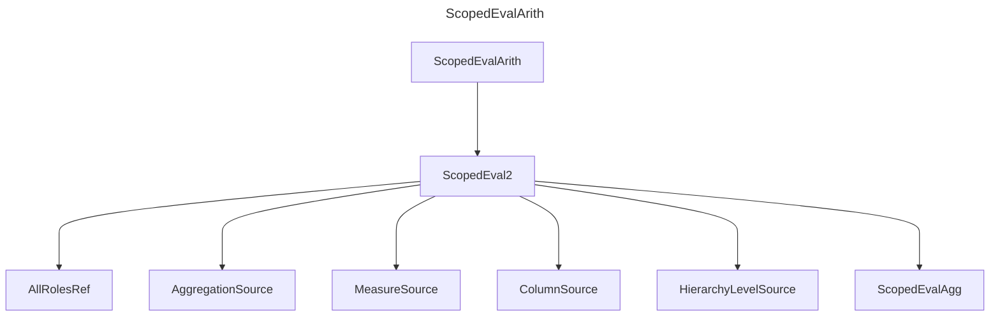

```mermaid
---
title: ScopedEvalArith
---
graph 
2721642009152["MeasureSource"]
2721642012080["HierarchyLevelSource"]
2721642030624["ScopedEvalArith"]
2721642007200["ScopedEvalAgg"]
2721642008176["AllRolesRef"]
2721642014032["ColumnSource"]
2721642003296["AggregationSource"]
2721642019888["ScopedEval2"]
2721642019888 ---> 2721642008176
2721642019888 ---> 2721642003296
2721642019888 ---> 2721642009152
2721642019888 ---> 2721642014032
2721642019888 ---> 2721642012080
2721642030624 ---> 2721642019888
2721642019888 ---> 2721642007200
```