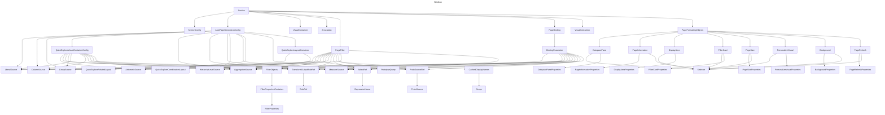

```mermaid
---
title: Section
---
graph 
2722254449264["PersonalizeVisual"]
2722254447312["VisualInteraction"]
2722254431696["DisplayArea"]
2722254460000["QuickExploreLayoutContainer"]
2722254458048["QuickExploreVisualContainerConfig"]
2722254414128["PageBinding"]
2721642039408["ProtoSource"]
2721642022816["LiteralSource"]
2721642040384["RoleRef"]
2722076087968["FilterObjects"]
2722254404368["PageSize"]
2721642012080["HierarchyLevelSource"]
2722254425840["FilterCard"]
2721641893008["FilterProperties"]
2721642014032["ColumnSource"]
2722076168976["Selector"]
2722254450240["QuickExploreCombinationLayout"]
2722254429744["PersonalizeVisualProperties"]
2722076148480["PageFilter"]
2721642035504["GroupSource"]
2722254441456["FilterCardProperties"]
2722076124080["CachedDisplayNames"]
2722254662032["VisualContainer"]
2722254416080["PageInformation"]
2722254423888["OutspacePane"]
2721642016960["SelectRef"]
2721642009152["MeasureSource"]
2722254451216["QuickExploreRelatedLayout"]
2722254428768["PageRefreshProperties"]
2722254435600["BackgroundProperties"]
2722254465856["Annotation"]
2722254412176["BindingParameter"]
2722254453168["AutoPageGenerationConfig"]
2722254437552["Background"]
2722254419984["PageSizeProperties"]
2721642013056["ExpressionName"]
2722254415104["PageInformationProperties"]
2721642031600["ArithmeticSource"]
2722254406320["SectionConfig"]
2721642023792["ProtoSourceRef"]
2721642024768["TransformOutputRoleRef"]
2722076123104["PrototypeQuery"]
2722254430720["DisplayAreaProperties"]
2722254439504["OutspacePaneProperties"]
2721641879344["FilterPropertiesContainer"]
2722254427792["PageRefresh"]
2722254478544["Section"]
2722076120176["Scope"]
2721642003296["AggregationSource"]
2722254461952["PageFormattingObjects"]
2722254461952 ---> 2722254423888
2722254460000 ---> 2722254451216
2722254453168 ---> 2721642022816
2722254412176 ---> 2721642012080
2722254412176 ---> 2721642014032
2722076148480 ---> 2721642031600
2722254412176 ---> 2721642035504
2722076148480 ---> 2722076087968
2722254453168 ---> 2721642014032
2722076148480 ---> 2721642022816
2722254423888 ---> 2722076168976
2722254431696 ---> 2722076168976
2722254461952 ---> 2722254416080
2722254453168 ---> 2721642035504
2721642016960 ---> 2721642013056
2722254453168 ---> 2722254458048
2722254453168 ---> 2721642003296
2722254404368 ---> 2722254419984
2722254425840 ---> 2722076168976
2722254478544 ---> 2722254406320
2722076148480 ---> 2721642012080
2722254461952 ---> 2722254431696
2722076148480 ---> 2722076123104
2722254412176 ---> 2721642003296
2722254412176 ---> 2721642031600
2722254460000 ---> 2722254450240
2722254453168 ---> 2721642024768
2722254458048 ---> 2721642031600
2722254427792 ---> 2722254428768
2722254461952 ---> 2722254425840
2722254461952 ---> 2722254404368
2722254478544 ---> 2722254453168
2722254478544 ---> 2722254662032
2722254453168 ---> 2721642009152
2722254453168 ---> 2721642012080
2722254478544 ---> 2722254465856
2722076148480 ---> 2721642003296
2722254453168 ---> 2721642016960
2722254416080 ---> 2722254415104
2722254423888 ---> 2722254439504
2722254427792 ---> 2722076168976
2722076148480 ---> 2721642014032
2722254453168 ---> 2721642031600
2722254425840 ---> 2722254441456
2722254478544 ---> 2722076148480
2722254461952 ---> 2722254449264
2722254458048 ---> 2721642009152
2722254453168 ---> 2721642023792
2722254458048 ---> 2721642024768
2722254449264 ---> 2722076168976
2722076148480 ---> 2721642024768
2722254404368 ---> 2722076168976
2722254412176 ---> 2721642022816
2722254478544 ---> 2722254414128
2722076148480 ---> 2721642016960
2722076087968 ---> 2721641879344
2722254412176 ---> 2721642009152
2722254478544 ---> 2722254447312
2722076148480 ---> 2722076124080
2722254416080 ---> 2722076168976
2722254453168 ---> 2722254460000
2722254458048 ---> 2721642035504
2722076148480 ---> 2721642023792
2722076148480 ---> 2721642035504
2722254478544 ---> 2722254461952
2722254431696 ---> 2722254430720
2722254458048 ---> 2721642022816
2722254458048 ---> 2721642014032
2722254437552 ---> 2722254435600
2722254412176 ---> 2721642023792
2721642024768 ---> 2721642040384
2722254412176 ---> 2721642016960
2721642023792 ---> 2721642039408
2722254449264 ---> 2722254429744
2722254437552 ---> 2722076168976
2722254461952 ---> 2722254437552
2722254414128 ---> 2722254412176
2722254412176 ---> 2721642024768
2721641879344 ---> 2721641893008
2722076148480 ---> 2721642009152
2722254458048 ---> 2721642012080
2722254458048 ---> 2721642016960
2722254458048 ---> 2721642003296
2722076124080 ---> 2722076120176
2722254458048 ---> 2721642023792
2722254461952 ---> 2722254427792
```