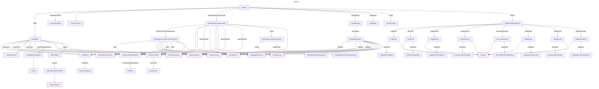

```mermaid
---
title: Section
---
graph 
2430693763904["PageSizeProperties"]
2430071814832["TransformOutputRoleRef"]
2430071366800["ExpressionName"]
2430693761952["OutspacePaneProperties"]
2430693817584["Section"]
2430693754144["BindingParameter"]
2430071944640["FilterObjects"]
2430693794160["PersonalizeVisual"]
2430072001248["PageFilter"]
2430071825568["ProtoSourceRef"]
2430693781472["FilterCard"]
2430071808976["GroupSource"]
style 2430071808976 stroke:#ff0000,stroke-width:1px
2430071973920["CachedDisplayNames"]
2430693768784["BackgroundProperties"]
2430071382416["ArithmeticSource"]
style 2430071382416 stroke:#ff0000,stroke-width:1px
2430693745360["VisualContainer"]
style 2430693745360 stroke:#ff0000,stroke-width:1px
2430071820688["RoleRef"]
2430071951472["PrototypeQuery"]
style 2430071951472 stroke:#ff0000,stroke-width:1px
2430693808800["AutoPageGenerationConfig"]
2430693795136["PageFormattingObjects"]
2430693769760["Background"]
2430693778544["PageRefresh"]
2430071359968["MeasureSource"]
style 2430071359968 stroke:#ff0000,stroke-width:1px
2430071356064["SelectRef"]
2430693798064["QuickExploreVisualContainerConfig"]
2430693749264["PageInformationProperties"]
2430693782448["PageRefreshProperties"]
2430693800992["QuickExploreRelatedLayout"]
2430693797088["VisualInteraction"]
2430693764880["PageSize"]
2430693775616["DisplayAreaProperties"]
2430071363872["HierarchyLevelSource"]
style 2430071363872 stroke:#ff0000,stroke-width:1px
2430693740480["PageBinding"]
2430693787328["PersonalizeVisualProperties"]
2430693773664["DisplayArea"]
2430071816784["LiteralSource"]
style 2430071816784 stroke:#ff0000,stroke-width:1px
2430693759024["PageInformation"]
2430693804896["QuickExploreCombinationLayout"]
2430071960256["Scope"]
style 2430071960256 stroke:#ff0000,stroke-width:1px
2430071358016["AggregationSource"]
style 2430071358016 stroke:#ff0000,stroke-width:1px
2430071933904["FilterPropertiesContainer"]
2430071745536["Selector"]
style 2430071745536 stroke:#ff0000,stroke-width:1px
2430693784400["FilterCardProperties"]
2430693752192["SectionConfig"]
2430071365824["ColumnSource"]
style 2430071365824 stroke:#ff0000,stroke-width:1px
2430071819712["ProtoSource"]
2430693760976["OutspacePane"]
2430693805872["QuickExploreLayoutContainer"]
2430693812704["Annotation"]
2430071915360["FilterProperties"]
style 2430071915360 stroke:#ff0000,stroke-width:1px
2430693808800 --->|visualContainerConfigurations| 2430693798064
2430693795136 --->|pageSize| 2430693764880
2430693795136 --->|filterCard| 2430693781472
2430693817584 --->|filters| 2430072001248
2430693769760 --->|properties| 2430693768784
2430693808800 ---> 2430071382416
2430693808800 ---> 2430071358016
2430693798064 --->|fields| 2430071825568
2430072001248 ---> 2430071363872
2430072001248 --->|expression| 2430071814832
2430693805872 --->|related| 2430693800992
2430693808800 --->|selectedFields| 2430071356064
2430072001248 ---> 2430071359968
2430693754144 --->|fieldExpr| 2430071356064
2430693808800 ---> 2430071816784
2430693798064 ---> 2430071816784
2430693798064 ---> 2430071382416
2430693769760 ---> 2430071745536
2430693754144 ---> 2430071363872
2430693808800 ---> 2430071808976
2430693817584 --->|visualInteractions| 2430693797088
2430693740480 --->|parameters| 2430693754144
2430693817584 ---> 2430693745360
2430693795136 --->|pageRefresh| 2430693778544
2430693778544 ---> 2430071745536
2430693795136 --->|outspacePane| 2430693760976
2430693759024 ---> 2430071745536
2430693798064 ---> 2430071808976
2430693817584 --->|autoPageGenerationConfig| 2430693808800
2430071944640 --->|general| 2430071933904
2430693754144 --->|fieldExpr| 2430071814832
2430693805872 --->|combination| 2430693804896
2430693760976 --->|properties| 2430693761952
2430071973920 ---> 2430071960256
2430693808800 ---> 2430071363872
2430693808800 ---> 2430071365824
2430072001248 --->|expression| 2430071356064
2430693795136 --->|personalizeVisuals| 2430693794160
2430693773664 ---> 2430071745536
2430693817584 --->|pageBinding| 2430693740480
2430693817584 --->|annotations| 2430693812704
2430693817584 --->|config| 2430693752192
2430693808800 --->|selectedFields| 2430071814832
2430693795136 --->|displayArea| 2430693773664
2430693808800 --->|selectedFields| 2430071825568
2430693798064 ---> 2430071359968
2430693781472 ---> 2430071745536
2430693795136 --->|background| 2430693769760
2430693754144 --->|fieldExpr| 2430071825568
2430071825568 --->|SourceRef| 2430071819712
2430693798064 ---> 2430071365824
2430693773664 --->|properties| 2430693775616
2430693754144 ---> 2430071359968
2430072001248 ---> 2430071951472
2430693808800 --->|layout| 2430693805872
2430072001248 ---> 2430071365824
2430072001248 --->|expression| 2430071825568
2430072001248 ---> 2430071358016
2430693798064 --->|fields| 2430071814832
2430071356064 --->|SelectRef| 2430071366800
2430693754144 ---> 2430071365824
2430693754144 ---> 2430071382416
2430693760976 ---> 2430071745536
2430072001248 --->|cachedDisplayNames| 2430071973920
2430693754144 ---> 2430071358016
2430693798064 --->|fields| 2430071356064
2430693778544 --->|properties| 2430693782448
2430071933904 ---> 2430071915360
2430693754144 ---> 2430071816784
2430693798064 ---> 2430071363872
2430693808800 ---> 2430071359968
2430072001248 ---> 2430071382416
2430693764880 --->|properties| 2430693763904
2430693798064 ---> 2430071358016
2430693794160 ---> 2430071745536
2430693817584 --->|objects| 2430693795136
2430072001248 ---> 2430071808976
2430693781472 --->|properties| 2430693784400
2430071814832 --->|TransformOutputRoleRef| 2430071820688
2430072001248 --->|objects| 2430071944640
2430072001248 ---> 2430071816784
2430693795136 --->|pageInformation| 2430693759024
2430693764880 ---> 2430071745536
2430693754144 ---> 2430071808976
2430693759024 --->|propeties| 2430693749264
2430693794160 --->|properties| 2430693787328
```