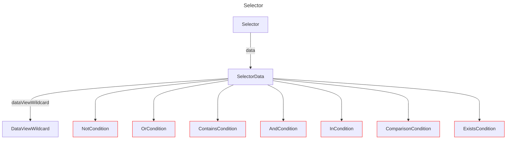

```mermaid
---
title: Selector
---
graph 
2430071874368["ComparisonCondition"]
style 2430071874368 stroke:#ff0000,stroke-width:1px
2430071846064["ContainsCondition"]
style 2430071846064 stroke:#ff0000,stroke-width:1px
2430071879248["OrCondition"]
style 2430071879248 stroke:#ff0000,stroke-width:1px
2430071880224["NotCondition"]
style 2430071880224 stroke:#ff0000,stroke-width:1px
2430071878272["ExistsCondition"]
style 2430071878272 stroke:#ff0000,stroke-width:1px
2430071761152["DataViewWildcard"]
2430071745536["Selector"]
2430071747488["SelectorData"]
2430071854848["InCondition"]
style 2430071854848 stroke:#ff0000,stroke-width:1px
2430071876320["AndCondition"]
style 2430071876320 stroke:#ff0000,stroke-width:1px
2430071745536 --->|data| 2430071747488
2430071747488 --->|dataViewWildcard| 2430071761152
2430071747488 ---> 2430071880224
2430071747488 ---> 2430071879248
2430071747488 ---> 2430071846064
2430071747488 ---> 2430071876320
2430071747488 ---> 2430071854848
2430071747488 ---> 2430071874368
2430071747488 ---> 2430071878272
```