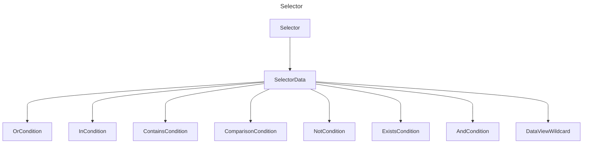

```mermaid
---
title: Selector
---
graph 
2721641843232["AndCondition"]
2721642095040["ComparisonCondition"]
2722076168976["Selector"]
2721642083328["InCondition"]
2721641850064["ExistsCondition"]
2721642084304["NotCondition"]
2721642068688["ContainsCondition"]
2722076152384["SelectorData"]
2722076155312["DataViewWildcard"]
2721641844208["OrCondition"]
2722076152384 ---> 2721641844208
2722076152384 ---> 2721642083328
2722076152384 ---> 2721642068688
2722076152384 ---> 2721642095040
2722076152384 ---> 2721642084304
2722076152384 ---> 2721641850064
2722076152384 ---> 2721641843232
2722076152384 ---> 2722076155312
2722076168976 ---> 2722076152384
```