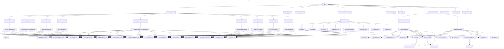

```mermaid
---
title: Slicer
---
graph 
2722216628576["_NumericInputStylePropertiesHelper"]
2721641835424["LiteralExpression"]
2722216615888["GeneralProperties"]
2721642039408["ProtoSource"]
2721642083328["InCondition"]
2721642022816["LiteralSource"]
2721642040384["RoleRef"]
2722216852080["SyncGroup"]
2721641858848["LinearGradient2Expression"]
2721641839328["AggregationExpression"]
2721641889104["GeoJsonExpression"]
2722076049904["QueryOptions"]
2721642012080["HierarchyLevelSource"]
2721642045264["ExpansionState"]
2722216654928["Slicer"]
2721642014032["ColumnSource"]
2721641883248["SelectRefExpression"]
2722076155312["DataViewWildcard"]
2721642035504["GroupSource"]
2721641874464["SolidColorExpression"]
2721641884224["ResourcePackageAccess"]
2722076034288["ProjectionConfig"]
2722216640288["_ItemPropertiesHelper"]
2722216625648["_HeaderPropertiesHelper"]
2722216870624["DateProperties"]
2721641852016["MeasureExpression"]
2722113511200["ColumnProperty"]
2721641844208["OrCondition"]
2721642095040["ComparisonCondition"]
2721641859824["LinearGradient3Expression"]
2721642058928["ExpansionStateRoot"]
2721641850064["ExistsCondition"]
2721642041360["Information"]
2722076152384["SelectorData"]
2722216636384["_PendingChangeIconPropertiesHelper"]
2721642016960["SelectRef"]
2721641886176["ImageExpression"]
2722216650048["PendingChangeIconProperties"]
2722216630528["NumericInputStyleProperties"]
2721642009152["MeasureSource"]
2721641876416["ColumnExpression"]
2721642042336["ExpansionStateChild"]
2722216665664["_SliderPropertiesHelper"]
2722216855008["CachedFilterDisplayItems"]
2722216638336["SelectionProperties"]
2722216652000["_SelectionPropertiesHelper"]
2721641891056["AlgorithmExpression"]
2721641892032["ExpressionList"]
2721641843232["AndCondition"]
2722216863792["DataProperties"]
2721642013056["ExpressionName"]
2721642031600["ArithmeticSource"]
2721642084304["NotCondition"]
2722216616864["HeaderProperties"]
2721642024768["TransformOutputRoleRef"]
2722076123104["PrototypeQuery"]
2721642023792["ProtoSourceRef"]
2722216871600["_GeneralPropertiesHelper"]
2722076109440["Filter"]
2722216647120["ItemProperties"]
2722216857936["_DataPropertiesHelper"]
2722216865744["_DatePropertiesHelper"]
2722076033312["VCProperties"]
2721641878368["ImageKindExpression"]
2722076045024["Display"]
2721642003296["AggregationSource"]
2721642068688["ContainsCondition"]
2722216660784["SlicerProperties"]
2722216657856["SliderProperties"]
2721642025744["ExpansionStateLevel"]
2722076152384 ---> 2721642083328
2722216863792 ---> 2722216857936
2722216871600 ---> 2721641874464
2722216652000 ---> 2721641874464
2722216628576 ---> 2721641852016
2721642042336 ---> 2721642016960
2722216654928 ---> 2722216660784
2722076152384 ---> 2721642084304
2722216865744 ---> 2721641891056
2722216628576 ---> 2721641859824
2722216654928 ---> 2722076049904
2722216665664 ---> 2721641859824
2722216640288 ---> 2721641878368
2722216665664 ---> 2721641874464
2722216660784 ---> 2722216615888
2721642042336 ---> 2721642012080
2722216660784 ---> 2722216630528
2722216857936 ---> 2721641883248
2722216871600 ---> 2721641883248
2722216665664 ---> 2721641839328
2722216871600 ---> 2721641835424
2722216625648 ---> 2721641876416
2721642016960 ---> 2721642013056
2722216857936 ---> 2721641839328
2722216857936 ---> 2721641859824
2722216665664 ---> 2721641876416
2722216665664 ---> 2721641892032
2722216857936 ---> 2721641878368
2722216625648 ---> 2721641889104
2721642025744 ---> 2721642031600
2722216660784 ---> 2722216616864
2721642025744 ---> 2721642022816
2722216625648 ---> 2721641852016
2722216628576 ---> 2721641878368
2722216660784 ---> 2722216870624
2722216628576 ---> 2721641886176
2722216628576 ---> 2721641839328
2722216865744 ---> 2721641889104
2722216640288 ---> 2721641876416
2721642045264 ---> 2721642058928
2722216865744 ---> 2721641835424
2721642042336 ---> 2721642022816
2722216857936 ---> 2721641874464
2722216660784 ---> 2722216650048
2721642042336 ---> 2721642031600
2722216640288 ---> 2721641889104
2722076152384 ---> 2721641844208
2722216871600 ---> 2721641858848
2722216640288 ---> 2721641891056
2721642042336 ---> 2721642003296
2722216654928 ---> 2722076123104
2722216625648 ---> 2721641891056
2722216625648 ---> 2721641858848
2722216865744 ---> 2721641874464
2722216636384 ---> 2721641839328
2722216652000 ---> 2721641858848
2722216652000 ---> 2721641884224
2721642045264 ---> 2721642025744
2722216636384 ---> 2721641891056
2722216628576 ---> 2721641876416
2722216652000 ---> 2721641891056
2722216871600 ---> 2721641878368
2722216857936 ---> 2721641858848
2722076152384 ---> 2722076155312
2721642042336 ---> 2721642035504
2722216640288 ---> 2721641839328
2722216652000 ---> 2721641878368
2722216652000 ---> 2721641876416
2722216665664 ---> 2721641858848
2722216640288 ---> 2721641886176
2722216636384 ---> 2721641878368
2722216647120 ---> 2722216640288
2722216625648 ---> 2721641892032
2722216654928 ---> 2722216855008
2722216857936 ---> 2721641876416
2721642025744 ---> 2721642035504
2722216636384 ---> 2721641858848
2722216640288 ---> 2721641852016
2722216628576 ---> 2721641858848
2722216865744 ---> 2721641884224
2722216628576 ---> 2721641892032
2722216636384 ---> 2721641889104
2721642042336 ---> 2721642024768
2722216628576 ---> 2721641835424
2722216665664 ---> 2721641891056
2722216665664 ---> 2721641886176
2721642025744 ---> 2721642023792
2722216652000 ---> 2721641889104
2722216865744 ---> 2721641859824
2722216865744 ---> 2721641876416
2722216650048 ---> 2722216636384
2722216871600 ---> 2721641839328
2722216636384 ---> 2721641852016
2722216660784 ---> 2722216638336
2722216665664 ---> 2721641889104
2722216871600 ---> 2721641886176
2722216865744 ---> 2721641886176
2722216640288 ---> 2721641892032
2722216857936 ---> 2721641852016
2722216857936 ---> 2721641835424
2722216660784 ---> 2722216657856
2722216865744 ---> 2721641883248
2722216628576 ---> 2721641891056
2722076152384 ---> 2721642095040
2721642042336 ---> 2721642023792
2722216636384 ---> 2721641884224
2721642025744 ---> 2721642012080
2722216636384 ---> 2721641886176
2722216636384 ---> 2721641876416
2722216871600 ---> 2722076109440
2722216654928 ---> 2722113511200
2722216871600 ---> 2721641889104
2722076152384 ---> 2721642068688
2721642025744 ---> 2721642009152
2722216616864 ---> 2722216625648
2722216865744 ---> 2721641858848
2722216865744 ---> 2721641839328
2722216652000 ---> 2721641886176
2722216857936 ---> 2721641884224
2722216665664 ---> 2721641884224
2722216625648 ---> 2721641859824
2722216640288 ---> 2721641859824
2722216865744 ---> 2721641852016
2722216871600 ---> 2721641859824
2722216638336 ---> 2722216652000
2722216628576 ---> 2721641884224
2722216640288 ---> 2721641883248
2722216857936 ---> 2721641891056
2722216628576 ---> 2721641883248
2722216871600 ---> 2721641852016
2722216871600 ---> 2721641891056
2721642025744 ---> 2721642041360
2722216628576 ---> 2721641889104
2721642025744 ---> 2721642003296
2722216865744 ---> 2721641892032
2722216636384 ---> 2721641883248
2722216625648 ---> 2721641878368
2722216652000 ---> 2721641852016
2721642042336 ---> 2721642009152
2722216870624 ---> 2722216865744
2722216857936 ---> 2721641889104
2722216625648 ---> 2721641886176
2722216654928 ---> 2722076045024
2722216625648 ---> 2721641874464
2722216871600 ---> 2721641884224
2722216640288 ---> 2721641874464
2722216871600 ---> 2721641892032
2722216654928 ---> 2721642045264
2722216857936 ---> 2721641886176
2722216652000 ---> 2721641892032
2722216625648 ---> 2721641883248
2722216625648 ---> 2721641835424
2722216636384 ---> 2721641874464
2721642042336 ---> 2721642014032
2722216857936 ---> 2721641892032
2722216640288 ---> 2721641858848
2722216636384 ---> 2721641859824
2722216665664 ---> 2721641883248
2722216628576 ---> 2721641874464
2722216865744 ---> 2721641878368
2722076152384 ---> 2721641850064
2722076152384 ---> 2721641843232
2722216665664 ---> 2721641852016
2722216652000 ---> 2721641859824
2721642025744 ---> 2721642014032
2722216636384 ---> 2721641835424
2722216636384 ---> 2721641892032
2721642024768 ---> 2721642040384
2721642023792 ---> 2721642039408
2721642025744 ---> 2721642016960
2722216665664 ---> 2721641835424
2722216652000 ---> 2721641835424
2722216657856 ---> 2722216665664
2721642025744 ---> 2721642024768
2721642058928 ---> 2721642042336
2722216855008 ---> 2722076152384
2722216625648 ---> 2721641884224
2722216654928 ---> 2722076033312
2722216871600 ---> 2721641876416
2722216654928 ---> 2722216852080
2722216652000 ---> 2721641839328
2722216652000 ---> 2721641883248
2722216660784 ---> 2722216647120
2722216630528 ---> 2722216628576
2722216665664 ---> 2721641878368
2722216625648 ---> 2721641839328
2722216640288 ---> 2721641835424
2722216654928 ---> 2722076034288
2722216660784 ---> 2722216863792
2722216640288 ---> 2721641884224
2721642042336 ---> 2721642042336
2722216615888 ---> 2722216871600
```