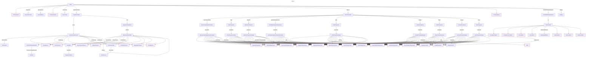

```mermaid
---
title: Slicer
---
graph 
2430071907552["SolidColorExpression"]
style 2430071907552 stroke:#ff0000,stroke-width:1px
2430664116896["PendingChangeIconProperties"]
2430071814832["TransformOutputRoleRef"]
2430071366800["ExpressionName"]
2430071878272["ExistsCondition"]
style 2430071878272 stroke:#ff0000,stroke-width:1px
2430071876320["AndCondition"]
style 2430071876320 stroke:#ff0000,stroke-width:1px
2430071921216["ResourcePackageAccess"]
style 2430071921216 stroke:#ff0000,stroke-width:1px
2430664331616["DataProperties"]
2430552678256["ColumnProperty"]
style 2430552678256 stroke:#ff0000,stroke-width:1px
2430071910480["LinearGradient3Expression"]
style 2430071910480 stroke:#ff0000,stroke-width:1px
2430664329664["CachedFilterDisplayItems"]
2430514817680["QueryOptions"]
2430664130560["SliderProperties"]
2430664348208["DateProperties"]
2430071879248["OrCondition"]
style 2430071879248 stroke:#ff0000,stroke-width:1px
2430664335520["GeneralProperties"]
2430664111040["SelectionProperties"]
2430071923168["SelectRefExpression"]
style 2430071923168 stroke:#ff0000,stroke-width:1px
2430664096400["NumericInputStyleProperties"]
2430664338448["_GeneralPropertiesHelper"]
2430664122752["_SelectionPropertiesHelper"]
2430664134464["SlicerProperties"]
2430071889008["AggregationExpression"]
style 2430071889008 stroke:#ff0000,stroke-width:1px
2430664108112["_ItemPropertiesHelper"]
2430071825568["ProtoSourceRef"]
2430071846064["ContainsCondition"]
style 2430071846064 stroke:#ff0000,stroke-width:1px
2430071808976["GroupSource"]
style 2430071808976 stroke:#ff0000,stroke-width:1px
2430664328688["SyncGroup"]
2430664095424["HeaderProperties"]
2430664094448["_PendingChangeIconPropertiesHelper"]
2430071813856["ExpansionStateChild"]
2430514810848["Display"]
2430071887056["LiteralExpression"]
style 2430071887056 stroke:#ff0000,stroke-width:1px
2430071747488["SelectorData"]
2430664090544["_HeaderPropertiesHelper"]
2430071382416["ArithmeticSource"]
style 2430071382416 stroke:#ff0000,stroke-width:1px
2430071874368["ComparisonCondition"]
style 2430071874368 stroke:#ff0000,stroke-width:1px
2430071820688["RoleRef"]
2430071951472["PrototypeQuery"]
style 2430071951472 stroke:#ff0000,stroke-width:1px
2430071930000["AlgorithmExpression"]
style 2430071930000 stroke:#ff0000,stroke-width:1px
2430071823616["ExpansionStateRoot"]
2430071761152["DataViewWildcard"]
2430071359968["MeasureSource"]
style 2430071359968 stroke:#ff0000,stroke-width:1px
2430664104208["ItemProperties"]
2430071817760["Information"]
2430071356064["SelectRef"]
2430071926096["ImageKindExpression"]
style 2430071926096 stroke:#ff0000,stroke-width:1px
2430664088592["_NumericInputStylePropertiesHelper"]
2430071827520["ExpansionState"]
2430514799136["ProjectionConfig"]
2430071925120["ColumnExpression"]
style 2430071925120 stroke:#ff0000,stroke-width:1px
2430071920240["LinearGradient2Expression"]
style 2430071920240 stroke:#ff0000,stroke-width:1px
2430071930976["ExpressionList"]
2430071363872["HierarchyLevelSource"]
style 2430071363872 stroke:#ff0000,stroke-width:1px
2430664140320["Slicer"]
2430071854848["InCondition"]
style 2430071854848 stroke:#ff0000,stroke-width:1px
2430071888032["MeasureExpression"]
style 2430071888032 stroke:#ff0000,stroke-width:1px
2430071816784["LiteralSource"]
style 2430071816784 stroke:#ff0000,stroke-width:1px
2430071919264["ImageExpression"]
style 2430071919264 stroke:#ff0000,stroke-width:1px
2430071989536["Filter"]
style 2430071989536 stroke:#ff0000,stroke-width:1px
2430071358016["AggregationSource"]
style 2430071358016 stroke:#ff0000,stroke-width:1px
2430071365824["ColumnSource"]
style 2430071365824 stroke:#ff0000,stroke-width:1px
2430071918288["GeoJsonExpression"]
style 2430071918288 stroke:#ff0000,stroke-width:1px
2430071819712["ProtoSource"]
2430514805968["VCProperties"]
style 2430514805968 stroke:#ff0000,stroke-width:1px
2430664129584["_SliderPropertiesHelper"]
2430071809952["ExpansionStateLevel"]
2430071880224["NotCondition"]
style 2430071880224 stroke:#ff0000,stroke-width:1px
2430664324784["_DataPropertiesHelper"]
2430664346256["_DatePropertiesHelper"]
2430664090544 ---> 2430071907552
2430071813856 --->|children| 2430071813856
2430664090544 ---> 2430071930000
2430664122752 ---> 2430071888032
2430664129584 ---> 2430071923168
2430664346256 --->|background| 2430071930976
2430664094448 ---> 2430071907552
2430664346256 ---> 2430071889008
2430071823616 --->|children| 2430071813856
2430664140320 ---> 2430514805968
2430664090544 ---> 2430071926096
2430664108112 ---> 2430071887056
2430664324784 ---> 2430071925120
2430664140320 --->|projections| 2430514799136
2430664338448 ---> 2430071889008
2430664129584 ---> 2430071889008
2430664346256 ---> 2430071888032
2430664346256 ---> 2430071921216
2430664129584 ---> 2430071921216
2430071747488 ---> 2430071846064
2430664094448 ---> 2430071921216
2430664129584 ---> 2430071910480
2430071747488 ---> 2430071874368
2430664108112 ---> 2430071888032
2430664096400 --->|properties| 2430664088592
2430664122752 ---> 2430071926096
2430664331616 --->|properties| 2430664324784
2430664088592 ---> 2430071926096
2430664134464 --->|numericInputStyle| 2430664096400
2430071809952 --->|AIInformation| 2430071817760
2430071747488 ---> 2430071879248
2430664094448 ---> 2430071923168
2430664088592 ---> 2430071888032
2430664324784 ---> 2430071887056
2430664088592 ---> 2430071930000
2430664094448 ---> 2430071920240
2430664088592 ---> 2430071910480
2430071813856 --->|identityValues| 2430071356064
2430664090544 ---> 2430071889008
2430664140320 --->|queryOptions| 2430514817680
2430664324784 ---> 2430071918288
2430071813856 --->|identityValues| 2430071814832
2430071809952 ---> 2430071365824
2430664088592 ---> 2430071925120
2430664338448 ---> 2430071926096
2430664324784 ---> 2430071907552
2430664129584 ---> 2430071920240
2430664122752 ---> 2430071925120
2430664108112 ---> 2430071918288
2430664130560 --->|properties| 2430664129584
2430664324784 ---> 2430071920240
2430664090544 ---> 2430071919264
2430664338448 ---> 2430071921216
2430664324784 ---> 2430071930000
2430664346256 ---> 2430071926096
2430664134464 --->|date| 2430664348208
2430071747488 ---> 2430071854848
2430664338448 ---> 2430071923168
2430664140320 ---> 2430552678256
2430664088592 ---> 2430071918288
2430664090544 ---> 2430071920240
2430071747488 --->|dataViewWildcard| 2430071761152
2430664140320 --->|syncGroup| 2430664328688
2430664129584 ---> 2430071887056
2430664129584 ---> 2430071918288
2430664094448 ---> 2430071925120
2430664324784 ---> 2430071910480
2430664122752 ---> 2430071918288
2430664094448 ---> 2430071930000
2430664140320 --->|expansionStates| 2430071827520
2430664122752 ---> 2430071923168
2430664108112 ---> 2430071930000
2430664122752 ---> 2430071921216
2430664134464 --->|selection| 2430664111040
2430664134464 --->|pendingChangesIcon| 2430664116896
2430664346256 ---> 2430071923168
2430664338448 --->|responsive| 2430071930976
2430664094448 ---> 2430071919264
2430664129584 ---> 2430071925120
2430664346256 ---> 2430071919264
2430664088592 ---> 2430071920240
2430664140320 --->|objects| 2430664134464
2430664090544 ---> 2430071918288
2430664122752 ---> 2430071907552
2430664108112 ---> 2430071920240
2430664108112 ---> 2430071910480
2430071747488 ---> 2430071876320
2430664094448 ---> 2430071888032
2430664129584 ---> 2430071888032
2430664094448 ---> 2430071918288
2430664088592 ---> 2430071889008
2430664111040 --->|properties| 2430664122752
2430664346256 ---> 2430071920240
2430071813856 ---> 2430071808976
2430664088592 ---> 2430071919264
2430664140320 ---> 2430071951472
2430071809952 ---> 2430071363872
2430664134464 --->|data| 2430664331616
2430664122752 ---> 2430071887056
2430071827520 --->|levels| 2430071809952
2430664338448 ---> 2430071930000
2430071809952 --->|identityKeys| 2430071814832
2430071813856 --->|identityValues| 2430071825568
2430664122752 ---> 2430071910480
2430071825568 --->|SourceRef| 2430071819712
2430664088592 ---> 2430071887056
2430664108112 ---> 2430071907552
2430664338448 ---> 2430071888032
2430664090544 ---> 2430071923168
2430664090544 ---> 2430071921216
2430664122752 --->|selectAllCheckboxEnabled| 2430071930976
2430664090544 ---> 2430071888032
2430664129584 ---> 2430071930000
2430664090544 ---> 2430071910480
2430664095424 --->|properties| 2430664090544
2430664129584 ---> 2430071919264
2430664338448 ---> 2430071989536
2430664324784 ---> 2430071919264
2430664324784 ---> 2430071923168
2430664088592 ---> 2430071923168
2430664134464 --->|header| 2430664095424
2430071809952 ---> 2430071808976
2430664122752 ---> 2430071920240
2430664338448 ---> 2430071925120
2430664108112 ---> 2430071889008
2430071356064 --->|SelectRef| 2430071366800
2430664338448 ---> 2430071907552
2430664346256 ---> 2430071925120
2430664094448 ---> 2430071926096
2430664104208 --->|properties| 2430664108112
2430664108112 ---> 2430071919264
2430664108112 ---> 2430071923168
2430664090544 ---> 2430071925120
2430664338448 ---> 2430071919264
2430664094448 ---> 2430071889008
2430071809952 ---> 2430071359968
2430664088592 --->|background| 2430071930976
2430664324784 ---> 2430071921216
2430664338448 ---> 2430071918288
2430664324784 --->|endDate| 2430071930976
2430664094448 ---> 2430071910480
2430664346256 ---> 2430071910480
2430071809952 ---> 2430071382416
2430664088592 ---> 2430071907552
2430664122752 ---> 2430071930000
2430664122752 ---> 2430071919264
2430071747488 ---> 2430071880224
2430664324784 ---> 2430071888032
2430664108112 ---> 2430071921216
2430664140320 --->|cachedFilterDisplayItems| 2430664329664
2430664088592 ---> 2430071921216
2430664116896 --->|properties| 2430664094448
2430664094448 --->|color| 2430071930976
2430664108112 ---> 2430071926096
2430071809952 ---> 2430071358016
2430664346256 ---> 2430071907552
2430071813856 ---> 2430071359968
2430071809952 --->|identityKeys| 2430071356064
2430664129584 --->|color| 2430071930976
2430664348208 --->|properties| 2430664346256
2430664338448 ---> 2430071910480
2430071813856 ---> 2430071365824
2430071814832 --->|TransformOutputRoleRef| 2430071820688
2430071813856 ---> 2430071363872
2430071747488 ---> 2430071878272
2430664338448 ---> 2430071887056
2430071809952 --->|identityKeys| 2430071825568
2430664129584 ---> 2430071926096
2430664140320 --->|display| 2430514810848
2430664329664 --->|id| 2430071747488
2430664122752 ---> 2430071889008
2430664134464 --->|slider| 2430664130560
2430071827520 --->|root| 2430071823616
2430664094448 ---> 2430071887056
2430664134464 --->|general| 2430664335520
2430071813856 ---> 2430071358016
2430664346256 ---> 2430071887056
2430071809952 ---> 2430071816784
2430664108112 ---> 2430071925120
2430664090544 --->|background| 2430071930976
2430071813856 ---> 2430071382416
2430664324784 ---> 2430071889008
2430664134464 --->|items| 2430664104208
2430664346256 ---> 2430071918288
2430664335520 --->|properties| 2430664338448
2430071813856 ---> 2430071816784
2430664324784 ---> 2430071926096
2430664129584 ---> 2430071907552
2430664090544 ---> 2430071887056
2430664338448 ---> 2430071920240
2430664346256 ---> 2430071930000
2430664108112 --->|background| 2430071930976
```