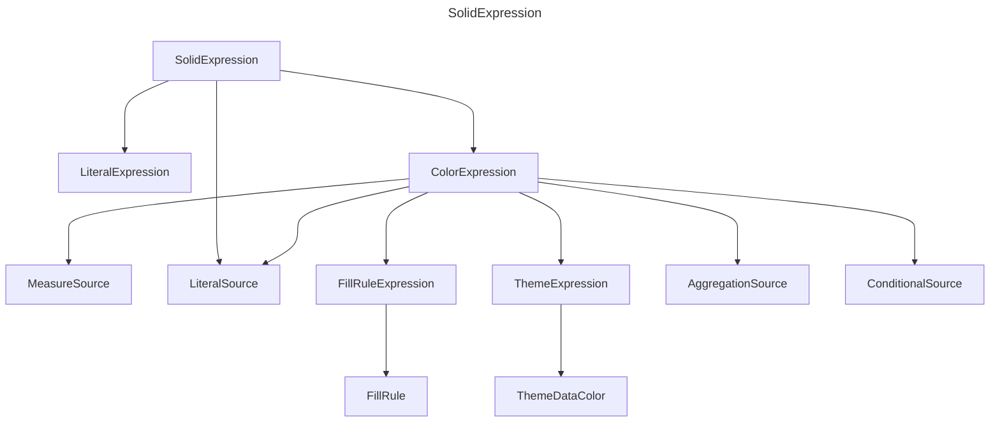

```mermaid
---
title: SolidExpression
---
graph 
2721642009152["MeasureSource"]
2721641835424["LiteralExpression"]
2721642022816["LiteralSource"]
2721641857872["SolidExpression"]
2721641855920["ThemeExpression"]
2721641852992["FillRule"]
2721641872512["ColorExpression"]
2721641853968["FillRuleExpression"]
2721642003296["AggregationSource"]
2721641862752["ConditionalSource"]
2721641836400["ThemeDataColor"]
2721641872512 ---> 2721642003296
2721641872512 ---> 2721641853968
2721641872512 ---> 2721642009152
2721641857872 ---> 2721642022816
2721641853968 ---> 2721641852992
2721641872512 ---> 2721641862752
2721641857872 ---> 2721641872512
2721641872512 ---> 2721641855920
2721641872512 ---> 2721642022816
2721641855920 ---> 2721641836400
2721641857872 ---> 2721641835424
```