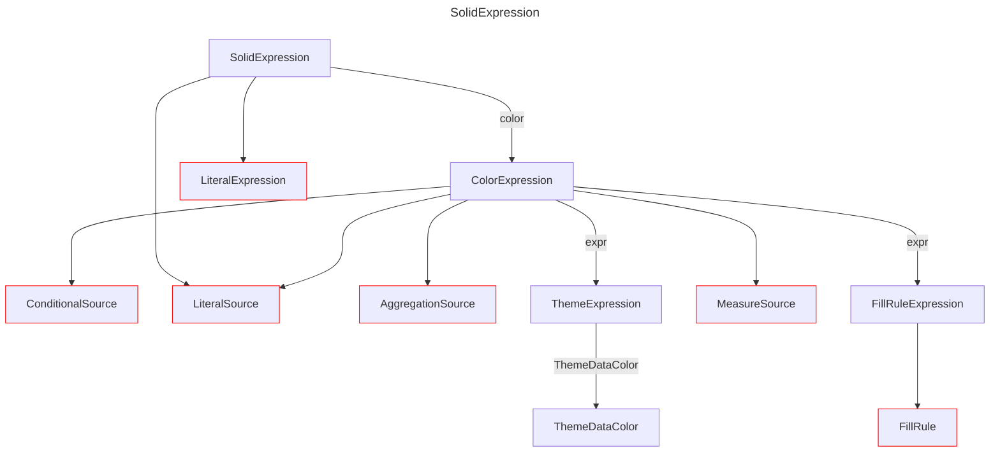

```mermaid
---
title: SolidExpression
---
graph 
2430071903648["ConditionalSource"]
style 2430071903648 stroke:#ff0000,stroke-width:1px
2430071898768["ColorExpression"]
2430071896816["SolidExpression"]
2430071895840["FillRule"]
style 2430071895840 stroke:#ff0000,stroke-width:1px
2430071816784["LiteralSource"]
style 2430071816784 stroke:#ff0000,stroke-width:1px
2430071358016["AggregationSource"]
style 2430071358016 stroke:#ff0000,stroke-width:1px
2430071892912["ThemeExpression"]
2430071359968["MeasureSource"]
style 2430071359968 stroke:#ff0000,stroke-width:1px
2430071897792["ThemeDataColor"]
2430071887056["LiteralExpression"]
style 2430071887056 stroke:#ff0000,stroke-width:1px
2430071890960["FillRuleExpression"]
2430071898768 ---> 2430071903648
2430071898768 ---> 2430071358016
2430071898768 ---> 2430071359968
2430071892912 --->|ThemeDataColor| 2430071897792
2430071896816 ---> 2430071816784
2430071898768 --->|expr| 2430071892912
2430071896816 --->|color| 2430071898768
2430071890960 ---> 2430071895840
2430071898768 --->|expr| 2430071890960
2430071898768 ---> 2430071816784
2430071896816 ---> 2430071887056
```