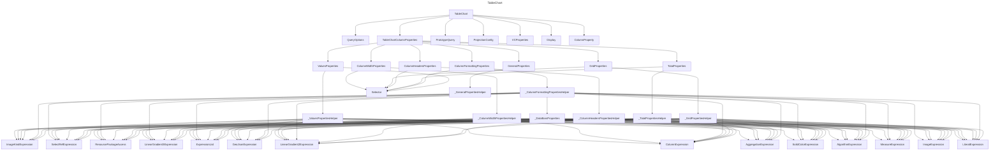

```mermaid
---
title: TableChart
---
graph 
2721641876416["ColumnExpression"]
2721641835424["LiteralExpression"]
2722216819872["ColumnWidthProperties"]
2722216848176["ValuesProperties"]
2721641858848["LinearGradient2Expression"]
2721641839328["AggregationExpression"]
2721641889104["GeoJsonExpression"]
2722076049904["QueryOptions"]
2722216837440["_TotalPropertiesHelper"]
2721641891056["AlgorithmExpression"]
2721641892032["ExpressionList"]
2722216804256["_ColumnFormattingPropertiesHelper"]
2722076168976["Selector"]
2722216801328["_ColumnWidthPropertiesHelper"]
2721641883248["SelectRefExpression"]
2722216850128["TableChartColumnProperties"]
2722076123104["PrototypeQuery"]
2722216829632["_GeneralPropertiesHelper"]
2722216835488["GridProperties"]
2721641874464["SolidColorExpression"]
2721641884224["ResourcePackageAccess"]
2722076034288["ProjectionConfig"]
2722216843296["_ValuesPropertiesHelper"]
2722216851104["TableChart"]
2721641852016["MeasureExpression"]
2722076033312["VCProperties"]
2721641878368["ImageKindExpression"]
2722076045024["Display"]
2722216831584["GeneralProperties"]
2722113511200["ColumnProperty"]
2722216810112["ColumnHeadersProperties"]
2722216830608["_GridPropertiesHelper"]
2722216809136["_ColumnHeadersPropertiesHelper"]
2722216814992["ColumnFormattingProperties"]
2721641859824["LinearGradient3Expression"]
2722216839392["TotalProperties"]
2721641886176["ImageExpression"]
2722216788640["_DataBarsProperties"]
2722216850128 ---> 2722216835488
2722216837440 ---> 2721641891056
2722216848176 ---> 2722076168976
2722216809136 ---> 2721641858848
2722216837440 ---> 2721641878368
2722216851104 ---> 2722216850128
2722216830608 ---> 2721641859824
2722216851104 ---> 2722076045024
2722216837440 ---> 2721641876416
2722216814992 ---> 2722076168976
2722216837440 ---> 2721641858848
2722216843296 ---> 2721641878368
2722216809136 ---> 2721641876416
2722216809136 ---> 2721641874464
2722216837440 ---> 2721641883248
2722216804256 ---> 2721641839328
2722216851104 ---> 2722076033312
2722216809136 ---> 2721641884224
2722216830608 ---> 2721641889104
2722216835488 ---> 2722216830608
2722216804256 ---> 2721641889104
2722216801328 ---> 2721641859824
2722216839392 ---> 2722076168976
2722216843296 ---> 2721641892032
2722216850128 ---> 2722216814992
2722216830608 ---> 2721641884224
2722216830608 ---> 2721641883248
2722216848176 ---> 2722216843296
2722216850128 ---> 2722216848176
2722216801328 ---> 2721641858848
2722216843296 ---> 2721641884224
2722216804256 ---> 2721641878368
2722216830608 ---> 2721641878368
2722216830608 ---> 2721641892032
2722216788640 ---> 2721641852016
2722216809136 ---> 2721641883248
2722216788640 ---> 2721641884224
2722216801328 ---> 2721641892032
2722216809136 ---> 2721641892032
2722216843296 ---> 2721641883248
2722216788640 ---> 2721641883248
2722216850128 ---> 2722216839392
2722216804256 ---> 2722216788640
2722216788640 ---> 2721641839328
2722216804256 ---> 2721641891056
2722216809136 ---> 2721641878368
2722216830608 ---> 2721641852016
2722216830608 ---> 2721641886176
2722216809136 ---> 2721641889104
2722216843296 ---> 2721641859824
2722216804256 ---> 2721641884224
2722216804256 ---> 2721641892032
2722216788640 ---> 2721641859824
2722216851104 ---> 2722113511200
2722216788640 ---> 2721641874464
2722216837440 ---> 2721641886176
2722216801328 ---> 2721641891056
2722216831584 ---> 2722216829632
2722216801328 ---> 2721641874464
2722216801328 ---> 2721641883248
2722216788640 ---> 2721641892032
2722216830608 ---> 2721641839328
2722216839392 ---> 2722216837440
2722216830608 ---> 2721641874464
2722216843296 ---> 2721641886176
2722216788640 ---> 2721641886176
2722216804256 ---> 2721641883248
2722216837440 ---> 2721641874464
2722216830608 ---> 2721641876416
2722216788640 ---> 2721641891056
2722216788640 ---> 2721641876416
2722216837440 ---> 2721641835424
2722216851104 ---> 2722076123104
2722216810112 ---> 2722216809136
2722216804256 ---> 2721641858848
2722216804256 ---> 2721641859824
2722216804256 ---> 2721641876416
2722216801328 ---> 2721641876416
2722216814992 ---> 2722216804256
2722216837440 ---> 2721641852016
2722216810112 ---> 2722076168976
2722216801328 ---> 2721641884224
2722216843296 ---> 2721641876416
2722216788640 ---> 2721641858848
2722216843296 ---> 2721641858848
2722216801328 ---> 2721641852016
2722216804256 ---> 2721641835424
2722216850128 ---> 2722216831584
2722216837440 ---> 2721641859824
2722216851104 ---> 2722076034288
2722216851104 ---> 2722076049904
2722216830608 ---> 2721641858848
2722216788640 ---> 2721641889104
2722216850128 ---> 2722216819872
2722216804256 ---> 2721641852016
2722216804256 ---> 2721641874464
2722216837440 ---> 2721641892032
2722216835488 ---> 2722076168976
2722216819872 ---> 2722076168976
2722216801328 ---> 2721641886176
2722216809136 ---> 2721641859824
2722216801328 ---> 2721641889104
2722216843296 ---> 2721641889104
2722216801328 ---> 2721641839328
2722216809136 ---> 2721641886176
2722216801328 ---> 2721641835424
2722216843296 ---> 2721641891056
2722216809136 ---> 2721641835424
2722216809136 ---> 2721641852016
2722216809136 ---> 2721641839328
2722216801328 ---> 2721641878368
2722216837440 ---> 2721641889104
2722216843296 ---> 2721641874464
2722216804256 ---> 2721641886176
2722216837440 ---> 2721641839328
2722216830608 ---> 2721641835424
2722216843296 ---> 2721641852016
2722216830608 ---> 2721641891056
2722216809136 ---> 2721641891056
2722216788640 ---> 2721641835424
2722216843296 ---> 2721641839328
2722216837440 ---> 2721641884224
2722216819872 ---> 2722216801328
2722216843296 ---> 2721641835424
2722216788640 ---> 2721641878368
2722216850128 ---> 2722216810112
```