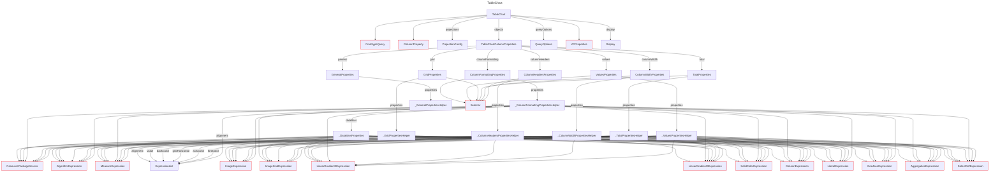

```mermaid
---
title: TableChart
---
graph 
2430626171200["_ColumnFormattingPropertiesHelper"]
2430664310144["_TotalPropertiesHelper"]
2430071951472["PrototypeQuery"]
style 2430071951472 stroke:#ff0000,stroke-width:1px
2430664275008["ColumnWidthProperties"]
2430071907552["SolidColorExpression"]
style 2430071907552 stroke:#ff0000,stroke-width:1px
2430071930000["AlgorithmExpression"]
style 2430071930000 stroke:#ff0000,stroke-width:1px
2430664308192["TotalProperties"]
2430071921216["ResourcePackageAccess"]
style 2430071921216 stroke:#ff0000,stroke-width:1px
2430071926096["ImageKindExpression"]
style 2430071926096 stroke:#ff0000,stroke-width:1px
2430664305264["TableChart"]
2430071887056["LiteralExpression"]
style 2430071887056 stroke:#ff0000,stroke-width:1px
2430552678256["ColumnProperty"]
style 2430552678256 stroke:#ff0000,stroke-width:1px
2430514799136["ProjectionConfig"]
2430071925120["ColumnExpression"]
style 2430071925120 stroke:#ff0000,stroke-width:1px
2430071920240["LinearGradient2Expression"]
style 2430071920240 stroke:#ff0000,stroke-width:1px
2430071930976["ExpressionList"]
2430664304288["TableChartColumnProperties"]
2430664293552["_GridPropertiesHelper"]
2430071910480["LinearGradient3Expression"]
style 2430071910480 stroke:#ff0000,stroke-width:1px
2430514817680["QueryOptions"]
2430071888032["MeasureExpression"]
style 2430071888032 stroke:#ff0000,stroke-width:1px
2430071923168["SelectRefExpression"]
style 2430071923168 stroke:#ff0000,stroke-width:1px
2430664288672["ColumnHeadersProperties"]
2430664277936["_GeneralPropertiesHelper"]
2430071919264["ImageExpression"]
style 2430071919264 stroke:#ff0000,stroke-width:1px
2430664294528["GeneralProperties"]
2430071745536["Selector"]
style 2430071745536 stroke:#ff0000,stroke-width:1px
2430071889008["AggregationExpression"]
style 2430071889008 stroke:#ff0000,stroke-width:1px
2430591807552["ColumnFormattingProperties"]
2430664298432["GridProperties"]
2430664316976["ValuesProperties"]
2430664283792["_ColumnHeadersPropertiesHelper"]
2430626166320["_DataBarsProperties"]
2430071918288["GeoJsonExpression"]
style 2430071918288 stroke:#ff0000,stroke-width:1px
2430514805968["VCProperties"]
style 2430514805968 stroke:#ff0000,stroke-width:1px
2430514810848["Display"]
2430664276960["_ColumnWidthPropertiesHelper"]
2430664311120["_ValuesPropertiesHelper"]
2430664283792 ---> 2430071910480
2430626171200 ---> 2430071910480
2430626166320 ---> 2430071919264
2430664276960 ---> 2430071921216
2430664304288 --->|columnWidth| 2430664275008
2430664310144 ---> 2430071887056
2430626171200 ---> 2430071926096
2430664283792 ---> 2430071888032
2430664293552 ---> 2430071910480
2430626166320 ---> 2430071887056
2430664283792 --->|alignment| 2430071930976
2430591807552 --->|properties| 2430626171200
2430664305264 ---> 2430552678256
2430664304288 --->|columnHeaders| 2430664288672
2430664311120 ---> 2430071918288
2430664310144 ---> 2430071919264
2430664276960 ---> 2430071930000
2430664275008 --->|properties| 2430664276960
2430664293552 ---> 2430071889008
2430664298432 --->|properties| 2430664293552
2430664283792 ---> 2430071887056
2430664276960 ---> 2430071888032
2430664304288 --->|general| 2430664294528
2430664310144 ---> 2430071918288
2430664276960 --->|value| 2430071930976
2430664311120 ---> 2430071930000
2430664276960 ---> 2430071919264
2430664311120 ---> 2430071919264
2430664293552 ---> 2430071930000
2430664308192 --->|properties| 2430664310144
2430626166320 ---> 2430071920240
2430664283792 ---> 2430071919264
2430664276960 ---> 2430071926096
2430664305264 ---> 2430071951472
2430626166320 ---> 2430071888032
2430626171200 ---> 2430071889008
2430664293552 ---> 2430071920240
2430664293552 ---> 2430071921216
2430591807552 ---> 2430071745536
2430664283792 ---> 2430071925120
2430664310144 ---> 2430071920240
2430664311120 ---> 2430071925120
2430626166320 ---> 2430071926096
2430626166320 ---> 2430071910480
2430664293552 ---> 2430071926096
2430626171200 ---> 2430071925120
2430626171200 ---> 2430071920240
2430626171200 ---> 2430071888032
2430664310144 ---> 2430071930000
2430664311120 ---> 2430071923168
2430626166320 ---> 2430071921216
2430664310144 ---> 2430071888032
2430664310144 ---> 2430071910480
2430664305264 --->|queryOptions| 2430514817680
2430664311120 ---> 2430071910480
2430664283792 ---> 2430071920240
2430664283792 ---> 2430071930000
2430664305264 --->|projections| 2430514799136
2430664311120 --->|backColor| 2430071930976
2430664276960 ---> 2430071920240
2430626166320 ---> 2430071907552
2430664310144 ---> 2430071923168
2430626171200 --->|dataBars| 2430626166320
2430664283792 ---> 2430071889008
2430664293552 ---> 2430071919264
2430664311120 ---> 2430071920240
2430664305264 --->|objects| 2430664304288
2430664288672 --->|properties| 2430664283792
2430664293552 ---> 2430071925120
2430626166320 ---> 2430071923168
2430664293552 ---> 2430071923168
2430664276960 ---> 2430071910480
2430664316976 ---> 2430071745536
2430664310144 ---> 2430071926096
2430664305264 ---> 2430514805968
2430664298432 ---> 2430071745536
2430664276960 ---> 2430071907552
2430664311120 ---> 2430071907552
2430626171200 ---> 2430071921216
2430664310144 ---> 2430071925120
2430664308192 ---> 2430071745536
2430664310144 ---> 2430071889008
2430664283792 ---> 2430071921216
2430664275008 ---> 2430071745536
2430664311120 ---> 2430071888032
2430626171200 ---> 2430071923168
2430664283792 ---> 2430071923168
2430664283792 ---> 2430071926096
2430664310144 ---> 2430071921216
2430626171200 ---> 2430071919264
2430664288672 ---> 2430071745536
2430626166320 ---> 2430071918288
2430664276960 ---> 2430071925120
2430626166320 ---> 2430071930000
2430664304288 --->|total| 2430664308192
2430664293552 ---> 2430071887056
2430626171200 ---> 2430071907552
2430664293552 --->|gridHorizontal| 2430071930976
2430664304288 --->|values| 2430664316976
2430664311120 ---> 2430071887056
2430664276960 ---> 2430071887056
2430664293552 ---> 2430071918288
2430664283792 ---> 2430071918288
2430664276960 ---> 2430071918288
2430626171200 ---> 2430071887056
2430664276960 ---> 2430071889008
2430664293552 ---> 2430071907552
2430664311120 ---> 2430071926096
2430626166320 ---> 2430071925120
2430664304288 --->|columnFormatting| 2430591807552
2430664276960 ---> 2430071923168
2430626166320 --->|axisColor| 2430071930976
2430626171200 ---> 2430071930000
2430664283792 ---> 2430071907552
2430664304288 --->|grid| 2430664298432
2430664316976 --->|properties| 2430664311120
2430664310144 --->|fontColor| 2430071930976
2430626166320 ---> 2430071889008
2430664310144 ---> 2430071907552
2430664305264 --->|display| 2430514810848
2430626171200 --->|alignment| 2430071930976
2430664294528 --->|properties| 2430664277936
2430664293552 ---> 2430071888032
2430664311120 ---> 2430071921216
2430626171200 ---> 2430071918288
2430664311120 ---> 2430071889008
```