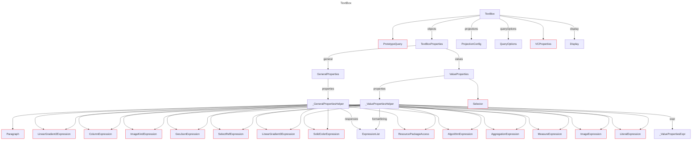

```mermaid
---
title: TextBox
---
graph 
2430071951472["PrototypeQuery"]
style 2430071951472 stroke:#ff0000,stroke-width:1px
2430071907552["SolidColorExpression"]
style 2430071907552 stroke:#ff0000,stroke-width:1px
2430071930000["AlgorithmExpression"]
style 2430071930000 stroke:#ff0000,stroke-width:1px
2430664153008["TextBoxProperties"]
2430664136416["_GeneralPropertiesHelper"]
2430071921216["ResourcePackageAccess"]
style 2430071921216 stroke:#ff0000,stroke-width:1px
2430071926096["ImageKindExpression"]
style 2430071926096 stroke:#ff0000,stroke-width:1px
2430664138368["GeneralProperties"]
2430664162768["_ValuePropertiesHelper"]
2430514799136["ProjectionConfig"]
2430071925120["ColumnExpression"]
style 2430071925120 stroke:#ff0000,stroke-width:1px
2430664158864["_ValuePropertiesExpr"]
2430071920240["LinearGradient2Expression"]
style 2430071920240 stroke:#ff0000,stroke-width:1px
2430071930976["ExpressionList"]
2430071910480["LinearGradient3Expression"]
style 2430071910480 stroke:#ff0000,stroke-width:1px
2430514817680["QueryOptions"]
2430071888032["MeasureExpression"]
style 2430071888032 stroke:#ff0000,stroke-width:1px
2430664155936["ValueProperties"]
2430071923168["SelectRefExpression"]
style 2430071923168 stroke:#ff0000,stroke-width:1px
2430071919264["ImageExpression"]
style 2430071919264 stroke:#ff0000,stroke-width:1px
2430071745536["Selector"]
style 2430071745536 stroke:#ff0000,stroke-width:1px
2430071889008["AggregationExpression"]
style 2430071889008 stroke:#ff0000,stroke-width:1px
2430071771888["Paragraph"]
style 2430071771888 stroke:#ff0000,stroke-width:1px
2430071918288["GeoJsonExpression"]
style 2430071918288 stroke:#ff0000,stroke-width:1px
2430514805968["VCProperties"]
style 2430514805968 stroke:#ff0000,stroke-width:1px
2430664166672["TextBox"]
2430514810848["Display"]
2430071887056["LiteralExpression"]
style 2430071887056 stroke:#ff0000,stroke-width:1px
2430664136416 ---> 2430071887056
2430664136416 ---> 2430071921216
2430664136416 ---> 2430071888032
2430664162768 ---> 2430071889008
2430664155936 ---> 2430071745536
2430664136416 ---> 2430071919264
2430664162768 ---> 2430071919264
2430664153008 --->|values| 2430664155936
2430664166672 --->|queryOptions| 2430514817680
2430664162768 ---> 2430071887056
2430664162768 ---> 2430071907552
2430664166672 --->|display| 2430514810848
2430664136416 ---> 2430071930000
2430664162768 --->|expr| 2430664158864
2430664136416 --->|responsive| 2430071930976
2430664162768 ---> 2430071888032
2430664136416 ---> 2430071918288
2430664153008 --->|general| 2430664138368
2430664136416 ---> 2430071925120
2430664162768 ---> 2430071910480
2430664136416 ---> 2430071923168
2430664166672 ---> 2430071951472
2430664166672 ---> 2430514805968
2430664162768 ---> 2430071930000
2430664155936 --->|properties| 2430664162768
2430664166672 --->|objects| 2430664153008
2430664162768 ---> 2430071923168
2430664162768 --->|formatString| 2430071930976
2430664136416 ---> 2430071910480
2430664136416 ---> 2430071889008
2430664136416 ---> 2430071926096
2430664162768 ---> 2430071926096
2430664138368 --->|properties| 2430664136416
2430664136416 ---> 2430071907552
2430664136416 ---> 2430071920240
2430664162768 ---> 2430071918288
2430664162768 ---> 2430071920240
2430664162768 ---> 2430071921216
2430664136416 ---> 2430071771888
2430664166672 --->|projections| 2430514799136
2430664162768 ---> 2430071925120
```