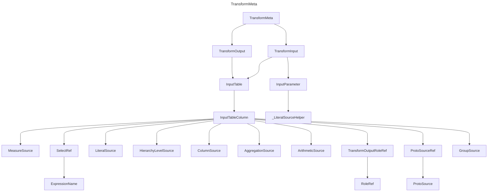

```mermaid
---
title: TransformMeta
---
graph 
2722076096752["InputParameter"]
2721642009152["MeasureSource"]
2721642039408["ProtoSource"]
2722076103584["InputTableColumn"]
2721642024768["TransformOutputRoleRef"]
2721642022816["LiteralSource"]
2721642040384["RoleRef"]
2722076100656["InputTable"]
2722076105536["TransformInput"]
2722076090896["TransformOutput"]
2721642012080["HierarchyLevelSource"]
2721642014032["ColumnSource"]
2722076116272["TransformMeta"]
2721642003296["AggregationSource"]
2721642038432["_LiteralSourceHelper"]
2721642013056["ExpressionName"]
2721642031600["ArithmeticSource"]
2721642016960["SelectRef"]
2721642023792["ProtoSourceRef"]
2721642035504["GroupSource"]
2722076103584 ---> 2721642009152
2722076103584 ---> 2721642016960
2722076100656 ---> 2722076103584
2722076103584 ---> 2721642035504
2722076103584 ---> 2721642022816
2722076105536 ---> 2722076096752
2722076090896 ---> 2722076100656
2722076103584 ---> 2721642024768
2722076105536 ---> 2722076100656
2722076103584 ---> 2721642003296
2721642024768 ---> 2721642040384
2722076103584 ---> 2721642012080
2721642023792 ---> 2721642039408
2721642016960 ---> 2721642013056
2722076116272 ---> 2722076105536
2722076096752 ---> 2721642038432
2722076103584 ---> 2721642023792
2722076103584 ---> 2721642014032
2722076103584 ---> 2721642031600
2722076116272 ---> 2722076090896
```