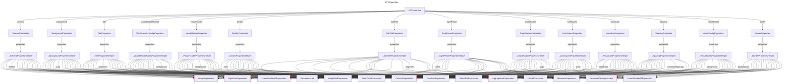

```mermaid
---
title: VCProperties
---
graph 
2430071805072["DropShadowProperties"]
2430071798240["DividerProperties"]
2430514781568["_VisualHeaderTooltipPropertiesHelper"]
2430514789376["VisualLinkProperties"]
2430514740576["LockAspectProperties"]
2430071907552["SolidColorExpression"]
style 2430071907552 stroke:#ff0000,stroke-width:1px
2430071792384["_DividerPropertiesHelper"]
2430071930000["AlgorithmExpression"]
style 2430071930000 stroke:#ff0000,stroke-width:1px
2430514761072["SubTitleProperties"]
2430071783600["_BorderPropertiesHelper"]
2430514747408["StylePresetProperties"]
2430071921216["ResourcePackageAccess"]
style 2430071921216 stroke:#ff0000,stroke-width:1px
2430514737648["_GeneralPropertiesHelper"]
2430071926096["ImageKindExpression"]
style 2430071926096 stroke:#ff0000,stroke-width:1px
2430071887056["LiteralExpression"]
style 2430071887056 stroke:#ff0000,stroke-width:1px
2430514748384["_TitlePropertiesHelper"]
2430071925120["ColumnExpression"]
style 2430071925120 stroke:#ff0000,stroke-width:1px
2430071920240["LinearGradient2Expression"]
style 2430071920240 stroke:#ff0000,stroke-width:1px
2430514773760["VisualHeaderProperties"]
2430071930976["ExpressionList"]
2430071910480["LinearGradient3Expression"]
style 2430071910480 stroke:#ff0000,stroke-width:1px
2430071888032["MeasureExpression"]
style 2430071888032 stroke:#ff0000,stroke-width:1px
2430514728864["_LockAspectPropertiesHelper"]
2430514726912["GeneralProperties"]
2430071802144["_DropShadowPropertiesHelper"]
2430071923168["SelectRefExpression"]
style 2430071923168 stroke:#ff0000,stroke-width:1px
2430514792304["VisualTooltipProperties"]
2430071919264["ImageExpression"]
style 2430071919264 stroke:#ff0000,stroke-width:1px
2430514795232["_VisualTooltipPropertiesHelper"]
2430514783520["VisualHeaderTooltipProperties"]
2430071889008["AggregationExpression"]
style 2430071889008 stroke:#ff0000,stroke-width:1px
2430514774736["_VisualHeaderPropertiesHelper"]
2430071782624["BackgroundProperties"]
2430514741552["_SpacingPropertiesHelper"]
2430514791328["_VisualLinkPropertiesHelper"]
2430071918288["GeoJsonExpression"]
style 2430071918288 stroke:#ff0000,stroke-width:1px
2430514805968["VCProperties"]
2430071766032["_BackgroundPropertiesHelper"]
2430514779616["TitleProperties"]
2430071791408["BorderProperties"]
2430514751312["SpacingProperties"]
2430514744480["_SubTitlePropertiesHelper"]
2430514745456["_StylePresetPropertiesHelper"]
2430071783600 --->|background| 2430071930976
2430514744480 ---> 2430071926096
2430514728864 ---> 2430071930000
2430514745456 ---> 2430071923168
2430071792384 ---> 2430071930000
2430514744480 ---> 2430071925120
2430514791328 ---> 2430071919264
2430071802144 ---> 2430071889008
2430071766032 ---> 2430071910480
2430514805968 --->|general| 2430514726912
2430514737648 ---> 2430071907552
2430071766032 ---> 2430071918288
2430514781568 ---> 2430071921216
2430514795232 ---> 2430071888032
2430071802144 ---> 2430071887056
2430071783600 ---> 2430071919264
2430514728864 ---> 2430071907552
2430071802144 ---> 2430071907552
2430071783600 ---> 2430071920240
2430071802144 ---> 2430071925120
2430514774736 ---> 2430071919264
2430071783600 ---> 2430071889008
2430514761072 --->|properties| 2430514744480
2430514745456 --->|name| 2430071930976
2430071802144 ---> 2430071921216
2430514748384 ---> 2430071930000
2430514791328 ---> 2430071930000
2430514737648 ---> 2430071919264
2430514745456 ---> 2430071919264
2430514795232 ---> 2430071907552
2430071802144 ---> 2430071920240
2430514774736 ---> 2430071888032
2430514781568 ---> 2430071925120
2430514789376 --->|properties| 2430514791328
2430514748384 ---> 2430071925120
2430514748384 ---> 2430071919264
2430514741552 ---> 2430071930000
2430514748384 ---> 2430071910480
2430071783600 ---> 2430071926096
2430514728864 ---> 2430071910480
2430514748384 ---> 2430071889008
2430514791328 --->|bookmark| 2430071930976
2430071783600 ---> 2430071923168
2430514744480 ---> 2430071918288
2430514774736 ---> 2430071930000
2430514781568 ---> 2430071919264
2430514795232 ---> 2430071910480
2430071783600 ---> 2430071918288
2430514744480 ---> 2430071923168
2430514795232 ---> 2430071926096
2430071802144 ---> 2430071910480
2430071805072 --->|properties| 2430071802144
2430514741552 ---> 2430071910480
2430071792384 --->|color| 2430071930976
2430514737648 ---> 2430071888032
2430514795232 ---> 2430071919264
2430514795232 ---> 2430071921216
2430071766032 ---> 2430071926096
2430071783600 ---> 2430071921216
2430514744480 ---> 2430071889008
2430514805968 --->|background| 2430071782624
2430514781568 ---> 2430071918288
2430514774736 ---> 2430071923168
2430514744480 ---> 2430071887056
2430514737648 --->|altText| 2430071930976
2430514741552 ---> 2430071887056
2430514795232 --->|background| 2430071930976
2430514791328 ---> 2430071918288
2430514728864 ---> 2430071919264
2430514748384 ---> 2430071888032
2430071792384 ---> 2430071907552
2430071802144 ---> 2430071888032
2430514781568 ---> 2430071889008
2430514737648 ---> 2430071887056
2430514773760 --->|properties| 2430514774736
2430514744480 ---> 2430071920240
2430514774736 ---> 2430071921216
2430514774736 ---> 2430071918288
2430514741552 ---> 2430071907552
2430514745456 ---> 2430071889008
2430514791328 ---> 2430071889008
2430514728864 ---> 2430071923168
2430514745456 ---> 2430071910480
2430514805968 --->|title| 2430514779616
2430514737648 ---> 2430071926096
2430514741552 ---> 2430071926096
2430514740576 --->|properties| 2430514728864
2430514745456 ---> 2430071930000
2430071792384 ---> 2430071920240
2430071792384 ---> 2430071926096
2430514741552 ---> 2430071889008
2430071766032 ---> 2430071919264
2430071802144 ---> 2430071930000
2430514781568 ---> 2430071923168
2430514805968 --->|visualHeaderTooltip| 2430514783520
2430514795232 ---> 2430071930000
2430071766032 ---> 2430071907552
2430514781568 ---> 2430071926096
2430514781568 ---> 2430071920240
2430071792384 ---> 2430071925120
2430514741552 ---> 2430071925120
2430514741552 ---> 2430071923168
2430514781568 ---> 2430071907552
2430071783600 ---> 2430071910480
2430514744480 ---> 2430071910480
2430514805968 --->|visualHeader| 2430514773760
2430514791328 ---> 2430071887056
2430514748384 --->|alignment| 2430071930976
2430514781568 ---> 2430071888032
2430514748384 ---> 2430071921216
2430514805968 --->|divider| 2430071798240
2430071792384 ---> 2430071918288
2430514745456 ---> 2430071918288
2430071792384 ---> 2430071919264
2430071766032 --->|color| 2430071930976
2430514745456 ---> 2430071887056
2430071766032 ---> 2430071888032
2430514781568 ---> 2430071887056
2430514795232 ---> 2430071920240
2430514748384 ---> 2430071923168
2430514744480 ---> 2430071919264
2430514728864 ---> 2430071888032
2430514741552 ---> 2430071918288
2430514783520 --->|properties| 2430514781568
2430514741552 ---> 2430071921216
2430071802144 ---> 2430071918288
2430071783600 ---> 2430071907552
2430514744480 ---> 2430071930000
2430514795232 ---> 2430071887056
2430514791328 ---> 2430071910480
2430514792304 --->|properties| 2430514795232
2430514745456 ---> 2430071925120
2430514781568 --->|background| 2430071930976
2430514805968 --->|subTitle| 2430514761072
2430514774736 ---> 2430071887056
2430514795232 ---> 2430071923168
2430514747408 --->|properties| 2430514745456
2430071802144 ---> 2430071923168
2430514748384 ---> 2430071887056
2430514791328 ---> 2430071926096
2430071766032 ---> 2430071925120
2430514745456 ---> 2430071926096
2430514728864 ---> 2430071918288
2430514748384 ---> 2430071907552
2430514737648 ---> 2430071925120
2430071792384 ---> 2430071887056
2430071766032 ---> 2430071930000
2430071766032 ---> 2430071887056
2430514745456 ---> 2430071888032
2430514774736 ---> 2430071926096
2430071782624 --->|properties| 2430071766032
2430071792384 ---> 2430071910480
2430514744480 ---> 2430071888032
2430514745456 ---> 2430071920240
2430514805968 --->|stylePreset| 2430514747408
2430514737648 ---> 2430071921216
2430514781568 ---> 2430071910480
2430514791328 ---> 2430071923168
2430514737648 ---> 2430071920240
2430514774736 --->|background| 2430071930976
2430514737648 ---> 2430071910480
2430514744480 --->|alignment| 2430071930976
2430514741552 ---> 2430071919264
2430514748384 ---> 2430071926096
2430514781568 ---> 2430071930000
2430514791328 ---> 2430071921216
2430514741552 --->|customizeSpacing| 2430071930976
2430071783600 ---> 2430071888032
2430514805968 --->|dropShadow| 2430071805072
2430071792384 ---> 2430071921216
2430071798240 --->|properties| 2430071792384
2430514805968 --->|lockAspect| 2430514740576
2430514728864 ---> 2430071925120
2430514791328 ---> 2430071925120
2430514791328 ---> 2430071920240
2430514795232 ---> 2430071925120
2430071766032 ---> 2430071921216
2430514728864 ---> 2430071920240
2430514791328 ---> 2430071907552
2430514795232 ---> 2430071918288
2430514748384 ---> 2430071918288
2430514726912 --->|properties| 2430514737648
2430071792384 ---> 2430071888032
2430514728864 --->|show| 2430071930976
2430514774736 ---> 2430071907552
2430514774736 ---> 2430071889008
2430514774736 ---> 2430071910480
2430071766032 ---> 2430071923168
2430071783600 ---> 2430071930000
2430514779616 --->|properties| 2430514748384
2430071802144 --->|angle| 2430071930976
2430514728864 ---> 2430071921216
2430514745456 ---> 2430071921216
2430514774736 ---> 2430071925120
2430071802144 ---> 2430071926096
2430514744480 ---> 2430071921216
2430514791328 ---> 2430071888032
2430514728864 ---> 2430071889008
2430514748384 ---> 2430071920240
2430514737648 ---> 2430071889008
2430514744480 ---> 2430071907552
2430514805968 --->|visualLink| 2430514789376
2430514805968 --->|spacing| 2430514751312
2430071783600 ---> 2430071887056
2430514805968 --->|visualTooltip| 2430514792304
2430514737648 ---> 2430071923168
2430071766032 ---> 2430071920240
2430514751312 --->|properties| 2430514741552
2430514805968 --->|border| 2430071791408
2430514741552 ---> 2430071920240
2430071783600 ---> 2430071925120
2430514737648 ---> 2430071918288
2430514728864 ---> 2430071926096
2430514745456 ---> 2430071907552
2430514774736 ---> 2430071920240
2430514728864 ---> 2430071887056
2430514741552 ---> 2430071888032
2430071791408 --->|properties| 2430071783600
2430514795232 ---> 2430071889008
2430071766032 ---> 2430071889008
2430071792384 ---> 2430071923168
2430514737648 ---> 2430071930000
2430071792384 ---> 2430071889008
2430071802144 ---> 2430071919264
```