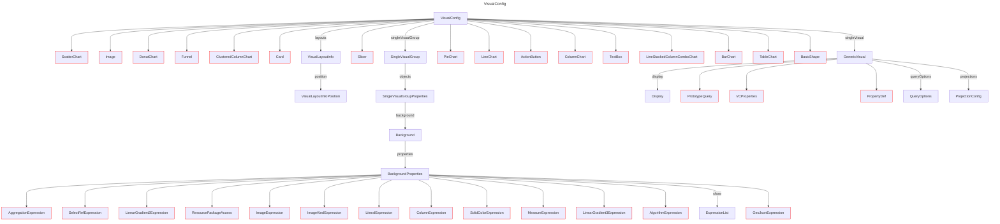

```mermaid
---
title: VisualConfig
---
graph 
2430552762192["BarChart"]
style 2430552762192 stroke:#ff0000,stroke-width:1px
2430664177408["SingleVisualGroup"]
2430071951472["PrototypeQuery"]
style 2430071951472 stroke:#ff0000,stroke-width:1px
2430591789984["Image"]
style 2430591789984 stroke:#ff0000,stroke-width:1px
2430071907552["SolidColorExpression"]
style 2430071907552 stroke:#ff0000,stroke-width:1px
2430626051152["LineStackedColumnComboChart"]
style 2430626051152 stroke:#ff0000,stroke-width:1px
2430071930000["AlgorithmExpression"]
style 2430071930000 stroke:#ff0000,stroke-width:1px
2430664182288["VisualLayoutInfoPosition"]
2430071921216["ResourcePackageAccess"]
style 2430071921216 stroke:#ff0000,stroke-width:1px
2430071926096["ImageKindExpression"]
style 2430071926096 stroke:#ff0000,stroke-width:1px
2430626167296["ScatterChart"]
style 2430626167296 stroke:#ff0000,stroke-width:1px
2430664305264["TableChart"]
style 2430664305264 stroke:#ff0000,stroke-width:1px
2430514799136["ProjectionConfig"]
2430664159840["BackgroundProperties"]
2430071925120["ColumnExpression"]
style 2430071925120 stroke:#ff0000,stroke-width:1px
2430071920240["LinearGradient2Expression"]
style 2430071920240 stroke:#ff0000,stroke-width:1px
2430071930976["ExpressionList"]
2430664140320["Slicer"]
style 2430664140320 stroke:#ff0000,stroke-width:1px
2430071910480["LinearGradient3Expression"]
style 2430071910480 stroke:#ff0000,stroke-width:1px
2430514817680["QueryOptions"]
2430071888032["MeasureExpression"]
style 2430071888032 stroke:#ff0000,stroke-width:1px
2430625957456["LineChart"]
style 2430625957456 stroke:#ff0000,stroke-width:1px
2430664170576["Background"]
2430071923168["SelectRefExpression"]
style 2430071923168 stroke:#ff0000,stroke-width:1px
2430664185216["VisualConfig"]
2430071919264["ImageExpression"]
style 2430071919264 stroke:#ff0000,stroke-width:1px
2430591777296["Funnel"]
style 2430591777296 stroke:#ff0000,stroke-width:1px
2430591784128["GenericVisual"]
2430664181312["VisualLayoutInfo"]
2430552646048["ClusteredColumnChart"]
style 2430552646048 stroke:#ff0000,stroke-width:1px
2430664176432["SingleVisualGroupProperties"]
2430591935408["ColumnChart"]
style 2430591935408 stroke:#ff0000,stroke-width:1px
2430071889008["AggregationExpression"]
style 2430071889008 stroke:#ff0000,stroke-width:1px
2430071918288["GeoJsonExpression"]
style 2430071918288 stroke:#ff0000,stroke-width:1px
2430514805968["VCProperties"]
style 2430514805968 stroke:#ff0000,stroke-width:1px
2430552673376["ActionButton"]
style 2430552673376 stroke:#ff0000,stroke-width:1px
2430552843200["Card"]
style 2430552843200 stroke:#ff0000,stroke-width:1px
2430626070672["PieChart"]
style 2430626070672 stroke:#ff0000,stroke-width:1px
2430664166672["TextBox"]
style 2430664166672 stroke:#ff0000,stroke-width:1px
2430591728496["DonutChart"]
style 2430591728496 stroke:#ff0000,stroke-width:1px
2430514815728["PropertyDef"]
style 2430514815728 stroke:#ff0000,stroke-width:1px
2430514810848["Display"]
2430071887056["LiteralExpression"]
style 2430071887056 stroke:#ff0000,stroke-width:1px
2430552806112["BasicShape"]
style 2430552806112 stroke:#ff0000,stroke-width:1px
2430664159840 ---> 2430071889008
2430664185216 ---> 2430626167296
2430664159840 ---> 2430071923168
2430664185216 ---> 2430591789984
2430664185216 ---> 2430591728496
2430591784128 --->|display| 2430514810848
2430664159840 ---> 2430071920240
2430664185216 ---> 2430591777296
2430664185216 ---> 2430552646048
2430664159840 ---> 2430071921216
2430664185216 ---> 2430552843200
2430664159840 ---> 2430071919264
2430664176432 --->|background| 2430664170576
2430664185216 --->|layouts| 2430664181312
2430664170576 --->|properties| 2430664159840
2430664159840 ---> 2430071926096
2430591784128 ---> 2430071951472
2430664185216 ---> 2430664140320
2430664185216 --->|singleVisualGroup| 2430664177408
2430664185216 ---> 2430626070672
2430664159840 ---> 2430071887056
2430664159840 ---> 2430071925120
2430591784128 ---> 2430514805968
2430664159840 ---> 2430071907552
2430664159840 ---> 2430071888032
2430664185216 ---> 2430625957456
2430664185216 ---> 2430552673376
2430664185216 ---> 2430591935408
2430591784128 ---> 2430514815728
2430664181312 --->|position| 2430664182288
2430664185216 ---> 2430664166672
2430664185216 ---> 2430626051152
2430664159840 ---> 2430071910480
2430664159840 ---> 2430071930000
2430664185216 ---> 2430552762192
2430664177408 --->|objects| 2430664176432
2430591784128 --->|queryOptions| 2430514817680
2430664159840 --->|show| 2430071930976
2430664185216 ---> 2430664305264
2430664159840 ---> 2430071918288
2430664185216 ---> 2430552806112
2430591784128 --->|projections| 2430514799136
2430664185216 --->|singleVisual| 2430591784128
```