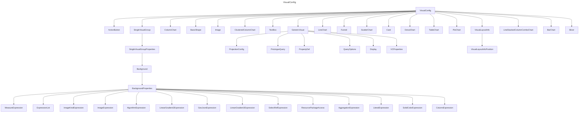

```mermaid
---
title: VisualConfig
---
graph 
2721641876416["ColumnExpression"]
2722144625952["Card"]
2722254555648["Background"]
2721641835424["LiteralExpression"]
2722113593184["BarChart"]
2721641858848["LinearGradient2Expression"]
2721641839328["AggregationExpression"]
2721641889104["GeoJsonExpression"]
2722076049904["QueryOptions"]
2722178322480["DonutChart"]
2722216791568["ScatterChart"]
2722144425872["ClusteredColumnChart"]
2721641891056["AlgorithmExpression"]
2722178315648["LineStackedColumnComboChart"]
2722178369328["GenericVisual"]
2721641892032["ExpressionList"]
2722254577120["VisualLayoutInfoPosition"]
2722178398608["Image"]
2722216654928["Slicer"]
2722254583952["VisualConfig"]
2722254560528["BackgroundProperties"]
2722144596672["BasicShape"]
2722113514128["ActionButton"]
2721641883248["SelectRefExpression"]
2722076123104["PrototypeQuery"]
2721641874464["SolidColorExpression"]
2722254581024["VisualLayoutInfo"]
2722178242448["LineChart"]
2721641884224["ResourcePackageAccess"]
2722076034288["ProjectionConfig"]
2722254564432["SingleVisualGroup"]
2722076032336["PropertyDef"]
2722216851104["TableChart"]
2722254566384["SingleVisualGroupProperties"]
2721641852016["MeasureExpression"]
2722076033312["VCProperties"]
2721641878368["ImageKindExpression"]
2722076045024["Display"]
2722254552720["TextBox"]
2722216710560["PieChart"]
2721641859824["LinearGradient3Expression"]
2722178366400["Funnel"]
2721641886176["ImageExpression"]
2722144508832["ColumnChart"]
2722254560528 ---> 2721641852016
2722254583952 ---> 2722113514128
2722254560528 ---> 2721641892032
2722254583952 ---> 2722254564432
2722254560528 ---> 2721641878368
2722254560528 ---> 2721641886176
2722254560528 ---> 2721641891056
2722254560528 ---> 2721641858848
2722254583952 ---> 2722144508832
2722254560528 ---> 2721641889104
2722254583952 ---> 2722144596672
2722254566384 ---> 2722254555648
2722254583952 ---> 2722178398608
2722254583952 ---> 2722144425872
2722178369328 ---> 2722076034288
2722254555648 ---> 2722254560528
2722254583952 ---> 2722254552720
2722178369328 ---> 2722076123104
2722178369328 ---> 2722076032336
2722254583952 ---> 2722178369328
2722254560528 ---> 2721641859824
2722254583952 ---> 2722178242448
2722254583952 ---> 2722178366400
2722254560528 ---> 2721641883248
2722254583952 ---> 2722216791568
2722254560528 ---> 2721641884224
2722254560528 ---> 2721641839328
2722254564432 ---> 2722254566384
2722254583952 ---> 2722144625952
2722254560528 ---> 2721641835424
2722254583952 ---> 2722178322480
2722254583952 ---> 2722216851104
2722254583952 ---> 2722216710560
2722178369328 ---> 2722076049904
2722178369328 ---> 2722076045024
2722254581024 ---> 2722254577120
2722254583952 ---> 2722254581024
2722254560528 ---> 2721641874464
2722254560528 ---> 2721641876416
2722254583952 ---> 2722178315648
2722254583952 ---> 2722113593184
2722254583952 ---> 2722216654928
2722178369328 ---> 2722076033312
```