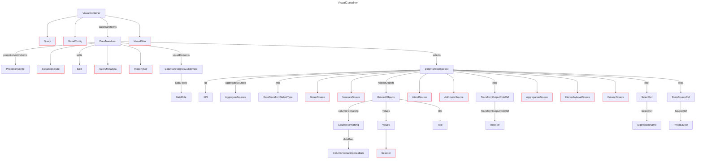

```mermaid
---
title: VisualContainer
---
graph 
2430664261344["DataRole"]
2430071820688["RoleRef"]
2430664265248["QueryMetadata"]
style 2430664265248 stroke:#ff0000,stroke-width:1px
2430664258416["Values"]
2430071814832["TransformOutputRoleRef"]
2430664266224["DataTransformSelectType"]
2430071366800["ExpressionName"]
2430664240848["Query"]
style 2430664240848 stroke:#ff0000,stroke-width:1px
2430664245728["KPI"]
2430071359968["MeasureSource"]
style 2430071359968 stroke:#ff0000,stroke-width:1px
2430071356064["SelectRef"]
2430664260368["ColumnFormatting"]
2430664268176["DataTransformSelect"]
2430071827520["ExpansionState"]
style 2430071827520 stroke:#ff0000,stroke-width:1px
2430664253536["ColumnFormattingDataBars"]
2430664249632["Split"]
2430514799136["ProjectionConfig"]
2430071363872["HierarchyLevelSource"]
style 2430071363872 stroke:#ff0000,stroke-width:1px
2430664263296["DataTransformVisualElement"]
2430664259392["RelatedObjects"]
2430071816784["LiteralSource"]
style 2430071816784 stroke:#ff0000,stroke-width:1px
2430664185216["VisualConfig"]
style 2430664185216 stroke:#ff0000,stroke-width:1px
2430071358016["AggregationSource"]
style 2430071358016 stroke:#ff0000,stroke-width:1px
2430071745536["Selector"]
style 2430071745536 stroke:#ff0000,stroke-width:1px
2430071825568["ProtoSourceRef"]
2430071365824["ColumnSource"]
style 2430071365824 stroke:#ff0000,stroke-width:1px
2430071808976["GroupSource"]
style 2430071808976 stroke:#ff0000,stroke-width:1px
2430071819712["ProtoSource"]
2430664232064["AggregateSources"]
2430664272080["DataTransform"]
2430664267200["Title"]
2430072005152["VisualFilter"]
style 2430072005152 stroke:#ff0000,stroke-width:1px
2430514815728["PropertyDef"]
style 2430514815728 stroke:#ff0000,stroke-width:1px
2430071382416["ArithmeticSource"]
style 2430071382416 stroke:#ff0000,stroke-width:1px
2430693745360["VisualContainer"]
2430693745360 ---> 2430664240848
2430664268176 --->|kpi| 2430664245728
2430664272080 --->|projectionActiveItems| 2430514799136
2430693745360 ---> 2430664185216
2430664272080 ---> 2430071827520
2430664263296 --->|DataRoles| 2430664261344
2430664258416 ---> 2430071745536
2430664268176 --->|aggregateSources| 2430664232064
2430071825568 --->|SourceRef| 2430071819712
2430693745360 --->|dataTransforms| 2430664272080
2430071814832 --->|TransformOutputRoleRef| 2430071820688
2430664268176 --->|type| 2430664266224
2430664268176 ---> 2430071808976
2430664268176 ---> 2430071359968
2430693745360 ---> 2430072005152
2430664259392 --->|columnFormatting| 2430664260368
2430071356064 --->|SelectRef| 2430071366800
2430664268176 --->|relatedObjects| 2430664259392
2430664272080 --->|splits| 2430664249632
2430664268176 ---> 2430071816784
2430664272080 ---> 2430664265248
2430664259392 --->|values| 2430664258416
2430664259392 --->|title| 2430664267200
2430664272080 ---> 2430514815728
2430664268176 ---> 2430071382416
2430664268176 --->|expr| 2430071814832
2430664260368 --->|dataBars| 2430664253536
2430664268176 ---> 2430071358016
2430664268176 ---> 2430071363872
2430664272080 --->|visualElements| 2430664263296
2430664268176 ---> 2430071365824
2430664268176 --->|expr| 2430071356064
2430664272080 --->|selects| 2430664268176
2430664268176 --->|expr| 2430071825568
```